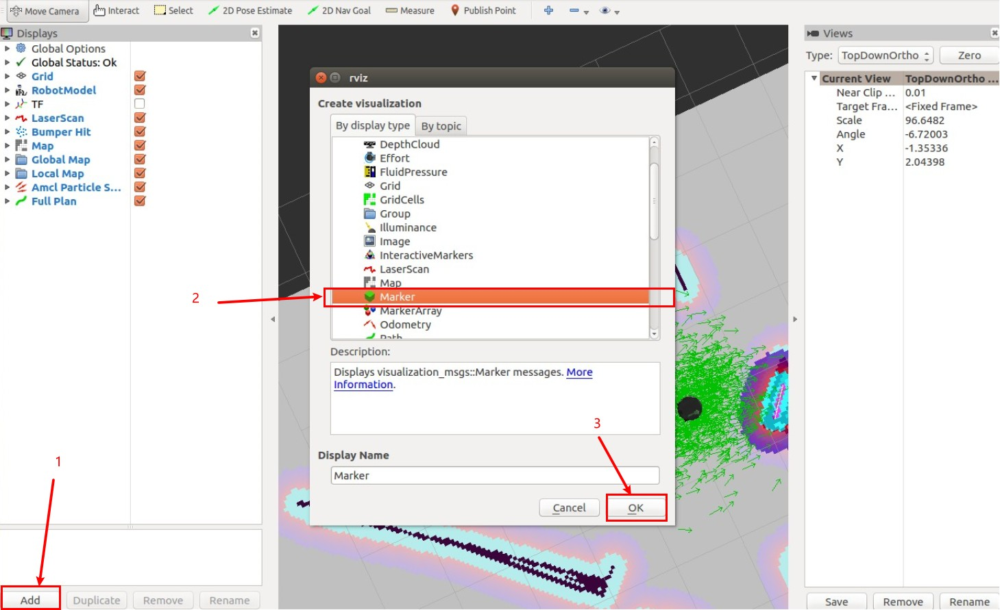
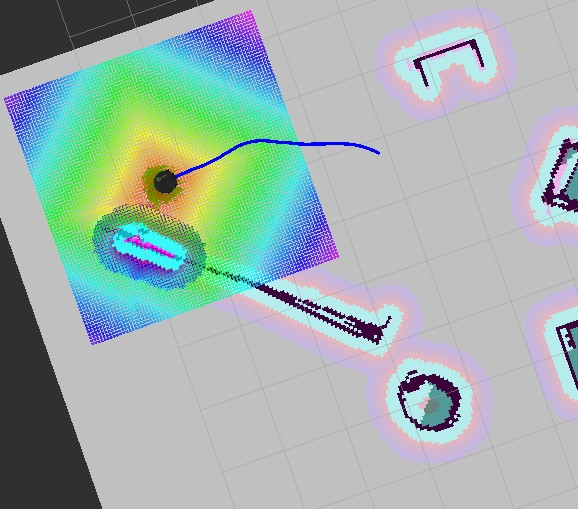

## 写在前面

最近有道作业题需要将机器人的历史路径显示出来，但是网上很多相关的教程都是搬运了官网的链接，并没有详细的操作流程。。。因此我又花费了很多时间去 ros 官网上学习 marker 的用法，学习怎么写 publisher 和 subscriber，最终成功将路径显示了出来。这篇文章是对这个过程的详细的介绍，原理和代码实践部分会分开，因此如果你赶时间只要一个结果的话，把详细的讲解跳过即可。不过我还是推荐看完，毕竟~~我花了这么多精力来写~~知其然也要知其所以然。

（我是 ROS 新手，从作业这一点也应该看出来了 XD，有不对的地方欢迎指正）

## 你应该已经完成了的准备工作

+ 已经配置好了 ROS工作环境。这一点不用多说，参考 [ROS wiki](http://wiki.ros.org)。
+ 这里我用的是 Gazebo 仿真环境和 RVIZ 可视化工具，这两个东西是安装ros时用官网上那个最全的安装包里自带（这里展示的是 kinetic 版本的安装命令，其他的版本到上面的链接里面找）：

```shell
$ sudo apt install ros-kinetic-desktop-full
```

+ 已经跟着 ROS wiki 建立了 catkin 工作区，我这里的工作区就是 wiki 上的 `~/catkin_ws`，如果你的不是在用户根目录下记得在后面执行命令的时候改掉。

+ 工作区目录下的 `src` 目录在系统的 `ROS_PACKAGE_PATH` 环境变量中，不在的话可以这样设置：

```shell
$ export ROS_PACKAGE_PATH=${ROS_PACKAEG_PATH}:${HOME}/catkin_ws/src
```

<!--more-->

## 写路径显示的执行结点

首先要创建一个 package，名为 `show_path`。如果用 python 倒是不需要，可我这用的是 C++：

```shell
$ cd ~/catkin_ws/src
$ catkin_create_pkg show_path std_msgs roscpp visualization_msgs tf
```

### 源代码

将下面的代码放进一个 cpp 文件，放在刚建好的 package 下的 src 目录下。即`~/catkin_ws/src/show_path/src/`

```cpp
#include <ros/ros.h>
#include <tf/transform_listener.h>
#include <visualization_msgs/Marker.h>

int main( int argc, char** argv )
{
  ros::init(argc, argv, "showpath");
  ros::NodeHandle n;
  ros::Publisher marker_pub = n.advertise<visualization_msgs::Marker>("visualization_marker", 10);
  ros::Rate r(10);
  tf::TransformListener listener;

  while (!ros::ok()){
    r.sleep();
  }

  visualization_msgs::Marker points, line_strip;
  points.header.frame_id = line_strip.header.frame_id = "/map";
  points.header.stamp = line_strip.header.stamp = ros::Time::now();
  points.ns = line_strip.ns = "showpath";
  points.action = line_strip.action = visualization_msgs::Marker::ADD;
  points.pose.orientation.w = line_strip.pose.orientation.w = 1.0;

  points.id = 0;
  line_strip.id = 1;

  points.type = visualization_msgs::Marker::POINTS;
  line_strip.type = visualization_msgs::Marker::LINE_STRIP;

  line_strip.scale.x = 0.05;

  line_strip.color.b = 1.0;
  line_strip.color.a = 1.0;

  float x(0), y(0);
  int cnt(0);

  while (ros::ok())
  {
    tf::StampedTransform transform;
    try{
      listener.lookupTransform("/map", "/base_footprint",
                               ros::Time(0), transform);
    }
    catch (tf::TransformException ex){
      ROS_ERROR("%s",ex.what());
      ros::Duration(1.0).sleep();
    }
    x = transform.getOrigin().x();
    y = transform.getOrigin().y();

    geometry_msgs::Point p;
    p.x = x;
    p.y = y;
    p.z = 0.1;

    if (cnt > 1) {line_strip.points.push_back(p);}
    else {cnt++;}

    marker_pub.publish(line_strip);

    r.sleep();

  }
}
```

### 源代码详解

下面我分块讲解以下本例中的源代码，方便大家根据需要更改。

```cpp
#include <ros/ros.h>
#include <tf/transform_listener.h>
#include <visualization_msgs/Marker.h>
```

引入必要的头文件。ros.h 是 C++ 的 api；transform_listener.h 的引入是为了获取机器人的坐标；Marker.h 则是 ros 的 message，本方法的主角。关于 Marker 的详细介绍参照 ROS 的 [Marker参考页](http://docs.ros.org/api/visualization_msgs/html/msg/Marker.html)。

```cpp
  ros::init(argc, argv, "showpath");
  ros::NodeHandle n;
  ros::Publisher marker_pub = n.advertise<visualization_msgs::Marker>("visualization_marker", 10);
  ros::Rate r(10);
  tf::TransformListener listener;
```

初始化结点，命名为 “showpath”，发布话题为 “visualization_marker”，频率为 10。同时声明tf坐标听者对象 `listener`。

```cpp
  while (!ros::ok()){
    r.sleep();
  }
```

等待 ros 连接

```cpp
  visualization_msgs::Marker points, line_strip;
  points.header.frame_id = line_strip.header.frame_id = "/map";
  points.header.stamp = line_strip.header.stamp = ros::Time::now();
  points.ns = line_strip.ns = "showpath";
  points.action = line_strip.action = visualization_msgs::Marker::ADD;
  points.pose.orientation.w = line_strip.pose.orientation.w = 1.0;
```

定义了两个对象并且将它们初始化：

* `points` 是点，并不显示，但是是组成线的基本单元。
* `line_strip` 是线，用于标示历史路径。

```cpp
  points.id = 0;
  line_strip.id = 1;
```

前面 `points` 和 `line_strip` 共用同一个 namespace 即 `showpath`，这里把两者的id作出区别以免发生冲突。

```cpp
  points.type = visualization_msgs::Marker::POINTS;
  line_strip.type = visualization_msgs::Marker::LINE_STRIP;
```

设置两种 Marker 的种类。

```cpp
  line_strip.scale.x = 0.05;

  line_strip.color.b = 1.0;
  line_strip.color.a = 1.0;
```

设置轨迹的宽度 (`scale`) 和颜色 (`color`)。这里设置宽度为 0.05， 颜色为蓝色不透明。

```cpp
tf::StampedTransform transform;
    try{
      listener.lookupTransform("/map", "/base_footprint",
                               ros::Time(0), transform);
    }
    catch (tf::TransformException ex){
      ROS_ERROR("%s",ex.what());
      ros::Duration(1.0).sleep();
    }
```

在连接的时间内，持续获取 `/map` 到 `/base_footprint` 的坐标，也就是机器人在地图上的坐标，返回到 `listener` 对象中。

```cpp
    x = transform.getOrigin().x();
    y = transform.getOrigin().y();

    geometry_msgs::Point p;
    p.x = x;
    p.y = y;
    p.z = 0.1;
```

取出机器人在地图上的坐标，并且记录在点 `p` 内。

```cpp
    if (cnt > 1) {line_strip.points.push_back(p);}
    else {cnt++;}
```

将点 `p` 加入 `line_strip` 内的点队列内。排除掉第一个点，第一个点**有可能**会初始化到原点，使路径中出现一段不该有的直线。当然，只是我个人遇到的问题，不敢说一定会这这样。

```cpp
    marker_pub.publish(line_strip);

    r.sleep();
```

发布话题以及必要的 `sleep`.

### 后续工作

在**刚建立的 package 里的** CMakeList.txt 中加入以下两行：

```cmake
add_executable(showpath src/showpath.cpp)
target_link_libraries(showpath ${catkin_LIBRARIES})
```

之后就可以开始愉快地 make 啦。

```shell
$ cd ~/catkin_ws
$ catkin_make
```

之后

```shell
$ source devel/setup.bash
```

## 显示路径

首先还是将 turtlebot 放进我们的仿真环境。这里就用默认的做个范例：

```shell
$ roslaunch turtlebot_gazebo turtlebot_world.launch
```

之后，启动自动导航，调出地图。

```shell
$ roslaunch turtlebot_gazebo amcl_demo.launch
$ roslaunch turtlebot_rviz_launchers view_navigation.launch
```

在rviz里订阅 `Marker` 话题：点击左下角的 “add”，在弹出的对话框中选择 Marker。



获取坐标需要一定的历史信息，所以可以先让机器人运动一下，再启动 `showpath` 节点：

```shell
$ rosrun show_path showpath
```

可能会有这样的报错信息，忽略就好，不影响最终效果（如果有知道为什么请赐教，在此谢过）


给机器人定个目标位姿，导航过去就可以看到路径用蓝色线条标出来啦。



PS:虽然这里是用导航来移动机器人的，但是我们标记历史路径的程序并没有用到导航信息。事实上这里用别的方式去移动机器人，也是可以画出路径的，只是，没有地图的话，这个路径的意义就不是那么明显了。

## 参考链接

* [Marker 基础形状教程](http://wiki.ros.org/rviz/Tutorials/Markers%3A%20Basic%20Shapes)
* [Marker 点和线教程](http://wiki.ros.org/rviz/Tutorials/Markers%3A%20Points%20and%20Lines)
* [Marker参考页](http://docs.ros.org/api/visualization_msgs/html/msg/Marker.html)
