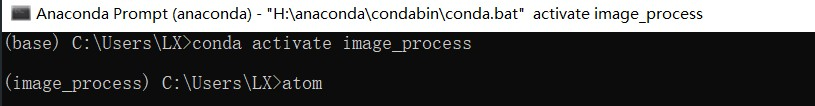

## 起因

### 我为什么选择 Atom

Atom 在 Windows 的文本编辑器里面可以说是完全拍的上号的，用的人也比较多。我选择 Atom 主要还是因为之前用过 Vim，而 Atom 的 Vim 插件已经把常用功能全部都做到位了，包括 (Ctrl + A / Ctrl + X) 进行数字增减的操作。加上一个 `ex-mode` 插件实现 `:` 命令，已经非常贴合 Vim 的使用体验了。
至于为什么不用 Vim 了，因为 Vim 现在更新到 8.2 了，我以前配置的 vimrc 已经搬不过来了（救救孩子，孩子已经看不懂怎么配了 TAT）

### Python 开发需求

为了便于管理第三方库，推荐在 Python 开发的时候构建虚拟环境。不过日常使用时，如果不是大项目，跑个作业或者测试程序，甚至可能代码还没有报错信息长，就没必要专门开一个虚拟环境了。
这时问题就来了，我安装的 Python 根目录下没有我想要的包，所以我想用虚拟环境的编译器去跑我的代码，但是我又不想在体验稀烂的 cmd 或者 Anaconda Prompt 里面去用命令跑我的程序，那怎么才能把这个功能集成到 Atom 里面呢？

<!--more-->

## 相关插件

### 运行程序用的 atom-python-run

这里我的 Atom 可以跑程序的关键是 [`atom-python-run`](https://atom.io/packages/atom-python-run) 这个插件：


这个插件允许你按下 `F5` 或 `F6` 就可以执行当前的程序。其实原理很简单，就是执行了一条自定义命令：


这条命令是可以更改的。改起来也很简单，只需要知道 `{file}` 代表的是当前文件，而每次按下 `F5` 都会执行一遍这条指令就好。

很显然，这个插件无法解决虚拟环境的问题。虽然你大可以把这条指令写明成用虚拟环境的 Python 编译器执行，但是其他插件的工作环境并没有变化。结果就是你写代码的时候 `pylint` 在不停地告诉你这个包找不到那个包不存在，强迫症当场去世。

### 虚拟环境插件尝试

所以我又去找了别的插件，参考了[这篇文章](https://blog.csdn.net/appleyuchi/article/details/78966415)找到了这个 [`atom-python-virtualenv`](https://atom.io/packages/atom-python-virtualenv).

博主在 Ubuntu 上搞好像没有问题，但我这 Windows 下却是不行的。尝试修改了很久的参数，却还是不行。最后，我翻到插件作者的说明，发现这个插件**暂时不支持 anaconda 的虚拟环境**！作者写了一个 To-Do list，其中有三项：

* 加入对用 pip 安装新包的支持；
* 加入对 pip 虚拟环境的支持；
* 加入对 conda 虚拟环境的支持。

也就意味着以上三者，现在都做不到。

## 解决方案

如果插件行不通的话，我想到的最简单的方法就是更改整个 Atom 的运行环境。Ubuntu 中 shell 的环境变量是可以继承到其子进程中的，也就是你在终端打开一个新的应用，这个应用的环境变量会继承这个终端的。在 Windows 内应该有类似的特性。

所以，我尝试从 Anaconda Prompt 中用命令启动 Atom：


 这个 base 环境下是没有 `opencv` 的，看到这里 `import cv2` 是报错的，继续运行也会出现错误。


而当我在 Anaconda Prompt 中更改虚拟环境再打开 Atom 时：



我发现 `pylint` 的报错消失了，程序也可以正常运行：


好诶！虽然这个方法肯定是做不到虚拟环境的热切换，但是本来就是写一个小项目要用，基本也不会有切换虚拟环境的需求，问题解决。

我这里是用 conda 的虚拟环境作的示例，实际上 pip 的虚拟环境也是一样的道理，只要先更改 shell 的环境变量，再在这个 shell 内执行 `atom` 命令打开 Atom 就完成了。

进一步，如果还是感觉这个解决方案需要每次启动都切换环境太麻烦，那么还有吧这两条命令封装起来，变成一个 bat 脚本文件。具体来说，新建一个文本文档，将以下命令：

```shell
start /k cmd "conda activate <your env> && atom"
```

输入，并将文档连同其扩展名重命名成一个 bat 文件，例如 `atom_venv.bat`。你可以把这个文件放在桌面，那么下次你希望启动虚拟环境为  `<your env>` 的 Atom，那么只需要把命令里的 `<your env>` 换成你的环境名就好。

这条命令会打开一个新的命令行窗口，并分别执行引号内 `&&` 前后的两条指令，感兴趣的话可以查一查相关的脚本编写资料 XD

## 完成

Atom， 包括我之前用的 Vim，有一个共同的毛病，就是对 Windows 的支持比不上 Linux。这也很无奈，毕竟两种操作系统最初的目标群体就是不同的，设计理念上就有很大的出入。

不过呢，两种系统在近年来其实有相互取长补短的意思。撇开 Linux 的人性化界面不说，微软已经为 Windows 10 做出了一个终端。在微软商店里搜索 “Windows Terminal” 即可下载安装。这东西是基于 PowerShell 的，包装得很好，用着自然是比 cmd 舒服多了。支持很多 Terminal 的功能，比如很好用的代码自动补全，还有自己的配置文件，可以保存 Python 的虚拟环境方便下次使用。
