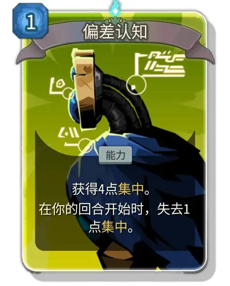

我有一个朋友，他是top3的本硕，靠自己的努力取得了全额奖学金出国留学，发表了三篇一作论文，算上合作论文加起来也有七八篇。他会做饭，会打羽毛球，会画画，与人为善，从来不得罪周边人；

我还有一个朋友，他很少自拍，甚至在洗手间也很会下意识地回避镜子。渴望与人建立连接却又不想表现得贪玩，想在工位摸摸鱼却又谨慎地听见脚步声就假装工作。

是的，如你所想，我，和这两个朋友，是一个人。但我还是想作为一个第三者的角度，来尽量客观地阐释，这个朋友所遭遇的一切。

## 自卑，成长的暗线

> 自卑杀死了我的青春。

他的中学可以说过的很压抑，在学习上是无休无止的压力，这一点越是好学生则越甚；而在学习之外我得到的反馈则几乎都是负面的。

他的皮肤不好，经常爆痘。跟皮肤光鲜的同学们比起来，这是最直接也是最无奈的负反馈。不照镜子的习惯大概也是从那时开始的。讨厌看到自己丑陋的样子，也就是无法接纳自己的外在。

他不像一个男孩，不喜欢打篮球，声音小，性格内向，不会说场面话。这是一个互为因果的复杂反馈。也说不清是先有鸡还是先有蛋，还是因为自己选择了这样结果没有做好承受责骂的觉悟，总之，因为不会说场面话，在饭局上总是被说"上了社会怎么办"云云。因为在这一点被否定，所以为了证明自己就拼命学习，自愿变得封闭。而不打篮球，大概是因为父亲喜欢打吧。父亲并不是一个好的榜样，而他的叛逆，就是将父亲身上的一切特质列为禁忌。

是的，叛逆。这是青春期的必经之路，叛逆会让人形成人格，在与外界的冲突中找到自我。而他的叛逆，是冲着宏观的旧社会去的。什么读书无用论啦，什么察言观色啦，什么推杯换盏满嘴跑火车啦，什么拍马屁啦，他最看不得的就是这些。然而这种愤怒又无处发泄，只能转而对内。所以，父母会说，这孩子很乖没怎么叛逆。然而，这种叛逆可能比任何逃学的人都要猛烈。

诶！那我们不去这个饭局不就好了吗？当然不行啦。这可是"锻炼"捏。

从父辈的圈层得不到认可，那就从同辈那里呗。你可是学霸啊。

唉，如果真的这么简单就好了。这种想法大概来自于母亲。她转学之后被孤立，理所当然地对高中的同学关系认知有偏差。这个朋友从她那里习得的相处之道就是：他人即地狱。不夸张地说，高中同学都是竞争关系，你帮助他们，就是在降低自己的排名。

这个逻辑乍一听没什么问题，尽管很扭曲，但在一分一千人的高压环境里，有这种想法也是正常。但问题也就出在这个合理性上。理性驱使他对此深信不疑，但没有人来告诉他，这种认知是不合乎情的。在河南高考的高压之下，有人分担是很重要的。如果将自己封闭起来，所有的喜怒哀乐都埋在心里，久而久之就会扭曲。于是，焦虑症发作了。他会因为一点小事而无法集中精力，无止境地内耗。同辈们的夸奖会被翻译成恭维，一点小小的吐槽就会被翻译成人身攻击。所以，从同辈那里，他也似乎得不到什么力量。

所以啊，有人说自己怀念高三生活，他总是说自己从来都没有怀念过。这没有问题，高中生活对他来说确实是灰黑色的，只是，他也确实希望自己的高中生活可以没有这么压抑啊。

总之，学习好是理所当然，考砸一次就天打雷劈；自己选择了在酒局装傻，却控制不了其他人的贬低；和同辈的关系处的非常抽象，无论夸赞还是贬低都会被解读为负面的。长期在这种环境下，怎么会不自卑呢。更何况皮肤还差。

然而，和一般的自卑又有所不同，他又有一颗想要证明自己的心。只要能证明自己是对的，就可以把一直以来积攒的怨气全部发泄出去，掀掉童年时的酒桌。所以，在自卑的情绪主基调中，也混入了些许的愤怒与不甘。

## 空心且不甘，自我PUA的高手

本科加硕士七年，过的很平淡。好像没有喜欢过谁，也没有被谁喜欢。就是那些主基调，努力学习，努力科研，申请奖学金，进实验室，发论文，能想到的好学生该做的事情。可以说他真的很羡慕那些能打一整天游戏的人，那些能连肝几天把一个游戏全成就的人，因为他做不到。他似乎找不到一个真正热爱的东西。我以为数学是那个热爱的东西，但是，我显然还是做不到为她投入一切吧。

因为叛逆没有正常到来，所以空心，不知道自己想要什么，下一步该怎么走；而因为长期的低自我认知和证明自己的迫切需要，他变得甘愿给人当牛做马。一个代表性的想法就是：

> 我不会说好话，长得也不好看，声音也小，balabala。。。，我这么差的一个人，能有表现自己的机会那是天大的福报啊。

其实，很荒谬。但，这就是真实的想法。

### 以低姿态入场，世界将回应以打击

于是，他加入学生会最累的部门宣传部，因为自己学过画画，有美术基础嘛。说到这个，学过画画算是一个为数不多他能说自己比别人强的点了，那肯定要利用一下不是。这个部门，其实就是乙方，不拿钱的乙方。给其他部门做宣传海报，改十几版最后再回到第一版也是家常便饭。你说正常人怎么会习惯这种生活呢？但他显然不是正常人的范畴。海报能通过，能打印出来摆在大家面前，这就是久旱之中的甘霖，可以稍微缓解一下他的自卑底色。

于是，他理所当然成为了部门最努力的人，理所当然地当上了下一任的部长。看到消息的第一感觉，并非兴奋，而是紧张。我自认为自己是做不了一把手的。但机会来了，不上也得上了。至少从当时发表的说说来看，他还挺乐观的：

 

但仔细想来，这大概也可以理解为一种对自我救赎的渴望。如果这一年的部长可以当好，那不就证明他其实不差，这样一来就可以把积怨已久的东西发泄出来，掀翻童年的酒桌了（回响形态了）吗？

结果，并不是很满意啊我说。他果然是当不了一把手。

他可以努力做到学的形似。假装提出改革意见，假装自己有个伟大的志向，但，真正的热忱是装不出来的。不知道是不是被开了太多的空头支票，他极其厌恶画这种没有保障的饼。但你知道的，做领导的哪能不会画饼啊。他至今还记得我在讲台上说的那句加入摄影组的好处"还可以约到好看的小哥哥和小姐姐哦！"他不知道这样做有什么好处，他只是觉得大家都这么说，那一定有道理。

结果就是，做不到啊，根本做不到啊。这个部门到最后溃不成军，只剩下几个核心成员还在响应号召。当他不得不打电话催小朋友接活的时候，他觉得自己糟糕透了。这是他的问题吗？我想只有一小部分是的，更大的问题出来把他放在这个位置上的领导班子和学生会越来越低的吸引力。这个部门的问题是历代积累的，他只是像一个被强行安排在王位的阿斗，心有余而力不足。

不过，至少对外界可以吹，算是增添了几分底气。无论如何，算是有点积极作用了。

### "天赋"：好学生的诅咒

一个低自我认知的人是很容易被pua的。这就包括说他有"天赋"。他太吃这个了。一个陷在自卑泥淖中的人，任何的夸奖都是在把他往外拉。毕竟天生我才必有用，自己其他方面样样都不行，那这个被认可的"天赋"就当然是自己的才能所在了。

但，这又有另一个问题。夸奖所带来的努力的动力当然可以让他快速地进步，但如果真的与有天赋的人去比较，他很快就会败下阵来。他不愿意相信他的天赋是假的，他太需要这个了。于是，他会将一切归咎于自己不够努力。

会源源不断的自我pua，一出问题就找自己的毛病，并且一定要比大多数人都要努力——这就是顶级牛马啊！我想这也是他能讨领导者喜欢的原因。假装自己真的有追求，给自己立一个喜欢科研，努力奋进的人设，然后真的在逼迫自己往这个方向走。

老师们的出发点当然是好的，只是对于自卑的他来说，这种好心多少有点饮鸩止渴。因为尝到了甜头，就像蚁群一样一直往这个方向走，走到最后却忘记了自己为何出发。自己也从整个蚁群，变成了一只高度分化的蚂蚁，只会机械性的执行自己生来的使命。

但人应该是蚁群。人不能是单向度的。

这可以说是一种创伤。因为被孤立，所以开始极端地寻求一些技术上的不可替代性，一旦这种不可替代性被认可，就会像抓住救命稻草一般不断地精进好让自己能被需要。

这构成了一种恶性的循环链条。自卑→被孤立妄想→尽全力精进技能→仍然技不如人→更加自卑。这个链条最大的问题在于需要外界的反馈，而这种反馈是冷酷无情的数据。他显然，并不聪明。他的记忆力不好，总是要花比别人更多的时间才能做完相同的事情。他不愿意承认，害怕放手这一根稻草之后自己被卷入万劫不复的深渊，本质上是一种心理防御机制。

但依赖外界的反馈体系终究是不稳定的。万一，我是说万一，放手之后反而会更好呢？

## 正确心态：我就烂

在听见朋友说他写论文菜的时候，他反而感到一些释然。是啊，当然很菜啦，这根救命稻草早就应该放手了。我说大大方方承认自己菜才是走出自卑的标志有没有懂的？

这种心态的转变，一部分是换了个压力没有这么大的环境，对于论文数据什么的没有那么看重了；另一部分则是见到了更多更优秀的人，他才更清楚自己的定位。

什么叫我努力了近1/3人生的事业到头来还是无法出类拔萃？因为这个世界的运行逻辑就是努力改变不了太多啊。有道是十年寒窗如何比得过三代积累，中国人一生都是关键时期，但所有的关键时期都比不过投胎。我的痛苦很大程度上来自于过分迷信主观能动性，认为自己主观的努力可以决定一切，但，从贫民窟读到哈佛的丽兹又有几个呢？

所以，放下这个执念吧。不要给自己立什么人设。一个虚伪的自己，就算成功了也会活成自己不想要的样子，更何况一生都在逆水行舟，太累了。

照照镜子，看看镜头。那个不完美的，真实的自己，才是生存的真正依靠。我可以不想学习，可以打一整天的游戏，可以渴望友情，渴望爱情，可以不想社交，也可以随意地打扰别人。更重要的，我可以将真实的自己展露出来，不必遮遮掩掩。毕竟，被自卑和愤怒统治了这么久，我有点不太正常也是合情合理的嘛。何必要装的像个正常人一样呢？

所以，所以，要允许真实的自己被看见。允许那个不完美的自己呈现在大家面前，并慢慢地找到那种"我想做"的冲动。试着和朋友们建立深度的连接，至少，自己心里的铠甲应该卸下一部分，不要让这种连接断在根子上。

自卑杀死了我青春的叛逆与真诚，但，谁说现在开始离经叛道就晚了呢？