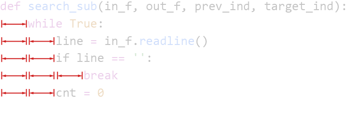
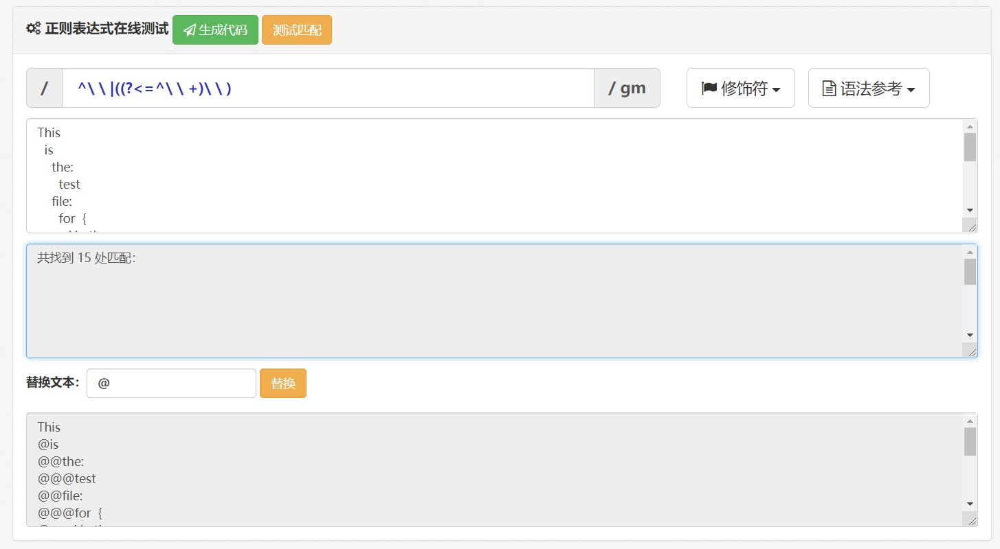
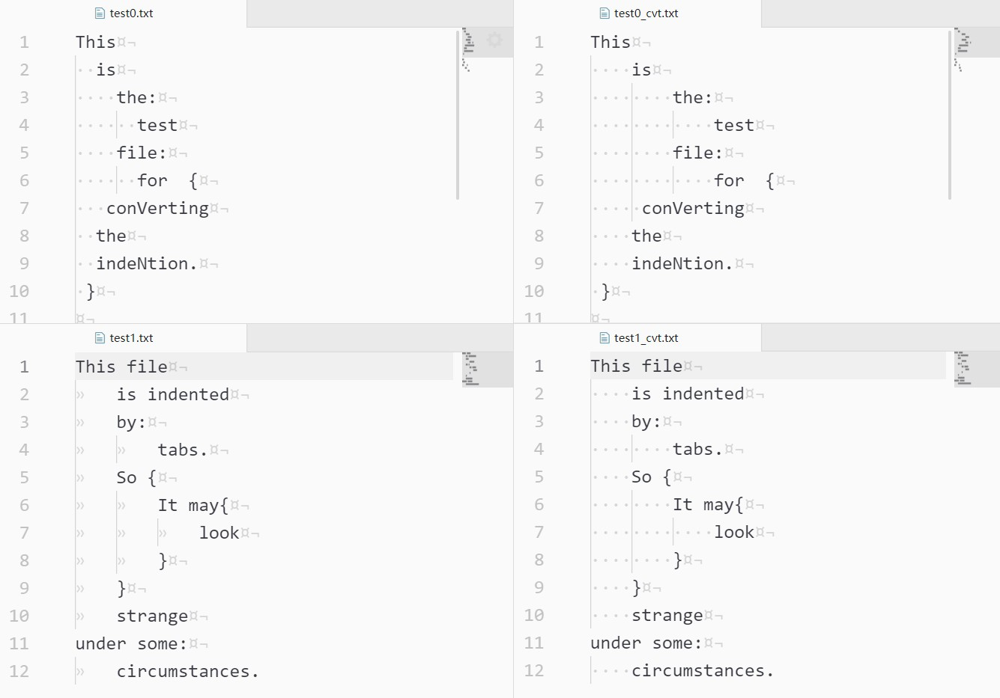

# 问题

前几天下载了别人的 Python 源码，代码作者用的缩进是 2 格，作为一个习惯 4 格空格缩进的人，一不留神就会把层级关系看错。我不禁想到 Python 开发圈子内，tab 党和空格党的友（chun）好（qiang）讨（she）论（jian）。虽然 Python 本身并未强制要求哪种缩进方式，但一旦出现不符合自己习惯的缩进就会切实地影响阅读。

一般来说，这一问题的解决方案有两种：

1. ~~说服代码原作者，让他按你的习惯来写代码；~~
2. 将代码里的缩进方式转换为符合自己习惯的缩进方式。

显然 1 不合适。于是我尝试自行开发一个小工具来实现这一功能，同时又学习了一下如何利用**正则表达式**来提取所有的缩进字符并替换。这里，我会给出两种解决方案，而使用哪一种也是可以通过一个参数选定的。

项目的源代码我已上传至 [GitHub 仓库](https://github.com/chzh9311/indentation_converter)，感兴趣的话可以下载下来试试看。

<!--more-->

# 核心思路和相关代码

整个小工具的工作思路就是**读取文件 → 替换缩进 → 输出**。核心自然是对缩进的查找和替换。

我们希望能提取出所有的缩进字符串，然后将它们替换成我们想要的另一种字符串。那么问题的核心就是查找所有的缩进了。

缩进字符的特点也很明显。首先它们全部都分布在行的起始到第一个非空字符之间，其次，它们是一串相同序列的重复。把这些缩进字符串用红色标出来，其实规律还是很明显的。



下面要做的就是根据这些规律寻找缩进字符串并将其替换。这里提供了两种思路：

## 一、顺序查找

这是最简单粗暴的解决方案，其实现代码如下。函数中的 4 个参数我也打了一张表放到下面：

| 参数           | 含义            | 举例                                  |
| ------------ | ------------- | ----------------------------------- |
| `in_f`       | 读取目标文件的文件流（读） | `in_f = open('path/to/file', 'r')`  |
| `out_f`      | 输出的文件流（写）     | `out_f = open('path/to/file', 'w')` |
| `prev_ind`   | 原文件缩进方式使用的字符串 | `'\t'`，`'  '`，`'    '`              |
| `target_ind` | 目标缩进方式的缩进字符串  | 同上                                  |

```python
def search_sub(in_f, out_f, prev_ind, target_ind):
    while True:
        # 逐行读取文件
        line = in_f.readline()

        # 判断是否为 EOF，是则退出。
        if line == '':
            break
        cnt = 0

        # 查找和替换
        try:
            while line[cnt*len(prev_ind):(cnt+1)*len(prev_ind)] == prev_ind:
                cnt += 1
        except IndexError:
            pass

        # 输出
        out_f.write(cnt*target_ind + line[cnt*len(prev_ind):])
```

具体的思路就是：对每一行文本，从起始位置开始重复以下过程：

* 取和 `prev_ind` 等长的字符串与 `prev_ind` 比较。
  * 如果不同，或该行剩余字符数小于 `prev_ind` 的长度，则立即终止循环；
  * 如果相同，则计数 `cnt` 加一，继续往后取等长字符串与 `prev_ind` 比较。

很明显啦，这里 `cnt` 计数的值就是缩进的等级，也就意味着这一行在正文前插入了多少个缩进字符串。得到了这个数字之后，下面只需要把 `cnt` 个 `target_ind` 插入正文前，就得到这一行的转换结果啦。

## 二、正则表达式

正则表达式最大的好处就是~~看起来高大上~~简洁。下面是用这种方式实现的代码：

```python
def re_sub(in_f, out_f, prev_ind, target_ind):
    # 参数的含义和前一节是一样的，就不解释了。
    # 读取文件内所有文本，这里不需要逐行处理了哦。
    text = in_f.read()

    # 关键！构建匹配用的 pattern.
    pattern = re.compile(
        '^%s|((?<=^%s+)%s)' % (prev_ind, prev_ind, prev_ind),
        flags=re.M
    )

    # 查找替换
    cvt_text = re.sub(pattern, target_ind, text)

    # 输出
    out_f.write(cvt_text)
```

看吧，删掉注释再写的紧凑一些，就**只有 4 行有效代码**了！甚至构建 `pattern` 和查找替换这两行还能合并成一行，其简洁性可见一斑。

但是！但是！这区区 4 行代码，却比第一种方法的 11 行代码多花了我不知道多少倍的时间 TAT

Jamie Zawinski 曾经说过一句很好玩的话：

> 有些人遇到了一个问题，他们想：“我知道了，我要用正则表达式。” 现在他们有两个问题了。


天才如 Jamie 也不得不承认，想写出简洁的正则表达式从来都不是什么轻松的事情。

探索（baidu）的过程就不放这里了，直接说结果。整个函数最重要的也就只有这一行，也就是匹配缩进用的正则表达式：

```python
'^%s|((?<=^%s+)%s)' % (prev_ind, prev_ind, prev_ind)
```

首先，就算你从没接触过正则，主要你系统学习过 Python，就应该认识 `%s`，它和后面的 `% prev_ind` 在一块儿表示格式化的输出。`%s` 对应的格式就是字符串，也就是只需要把 `prev_ind` 替换掉表达式里的 `%s`，它就是一个真正意义上的正则表达式了。

整个表达式用到的符号的含义如下：

* `^`：匹配文本起始。在多行模式下（在最后的 `flags` 中指定 `re.M`），也会匹配每个 `\n` 后面的位置，即每一行的起始；
* `|`：或，即前后两者只要出现其一就算成功的匹配；
* `()`：括号内的部分作为一个整体；
* `+`：匹配前面的表达式至少 1 次；
* `?<=`：这个符号用于修饰后面的 `^%s+`，表示其匹配结果要出现在最终匹配结果之前而不计入最终的匹配结果。在正则表达式中，这类实际并进入匹配结果的修饰符被称为**零宽断言**。

以 `|` 为分界来看看匹配的思路是什么。前面的 `^%s` 表示出现在行首的缩进字符串，即这一部分匹配的是第一级缩进。

后面的有两层括号。内部的一层，包含一个零宽断言，表示匹配结果的前面应该出现的是和 `^%s+` 匹配的字符串，也就是任意级的缩进。第二层括号里在第一层的基础上加了 `%s`，也就是匹配结果本身应该是一个缩进字符串。所以这里匹配的就是在任意级缩进后面跟着的缩进字符串。

简单理解，就是把所有的缩进分为了**位于每行开头的缩进**和**位于每行中间的缩进**。

用[在线工具](http://c.runoob.com/front-end/854)测试一下，效果还是不错的：



不过要注意的一点是，代码里使用的 `re` 并非 Python 自带的正则表达库，而是 `regex` 库，前者是不支持宽度不定的后发断言（即 `?<=%s+`）的。

# 使用方法

从 GitHub 下载代码后，只要保证你的 Python 环境中有 `argparse` 和 `regex` 就可以正常运行啦，如果你不知道有么有，那么直接打开命令行或者终端，键入

```shell
pip install argparse regex
```

`pip` 会自动检查，如果没有就会安装。

利用 `argparse` 我定义了一些可以在外部指定的参数如下，每个参数都对应有缩写。

```python
parser = argparse.ArgumentParser(
    description="arguments for converting indentations")
parser.add_argument("-f", "--file",
                    type=str, help="path to the file")
parser.add_argument("-p", "--prev",
                    type=str, default=config['default_prev_indent'],
                    help="the previous indentation to be converted")
parser.add_argument("-t", "--target",
                    type=str, default=config['default_target_indent'],
                    help="the target indentation to convert to")
parser.add_argument("-a", "--appendix",
                    type=str, default=config['appendix'],
                    help="what to append to the converted file")
```

那么，使用方法就很简单了。在 `ind_cvt.py` 同级目录下打开终端，键入

```shell
python ind_cvt.py -f path/to/file.extension -p <prev_ind> -t <target_ind> -a <your appendix>
```

举个例子，对项目自带的测试文件进行操作：

```shell
python ind_cvt.py -f test_files/test1.txt -p '  ' -t '    ' -a '_converted'
```

就会在 test1.py 的同级目录下生成 test1_converted.py 里面是将原文件的 2 空格缩进全部变成 4 空格缩进后的结果。

两个测试都转换为 4 空格缩进的结果如下图所示。左侧为原文件，右侧是转换的结果。这是 Atom 的默认表示方法，即 `·` 表示空格，`¤` 表示 `\r`，`¬` 表示 `\n`，`»` 表示 `\t`。



另外，除了 `-f` 参数指定文件外，其余参数均有默认值，可以缺省。默认值在 config.py 文件里面以字典形式存储，是可以调节的：

```python
config = {'appendix': '_cvt',                 # 对应参数 -a 或 --appendix 的默认值
          'default_prev_indent': '  ',        # 对应参数 -p 或 --prev     的默认值
          'default_target_indent': '    ',    # 对应参数 -t 或 --target   的默认值
          'method': 're'                      # 不对应参数，用于方式选择：'re' 表示正则，'search' 表示搜索
          }
```

# 总结

这个项目最开始我并没有打算传到 GitHub 上面。一方面因为这个功能不难实现，其心就是第二节列出的两个函数，整个项目的有效代码目前并不超过 100 行；另一方面则是因为一些编辑器（比如 VS Code）或者其它的现有工具（比如 [autopep8](https://pypi.org/project/autopep8/)）已经提供了类似的功能。可是，为了实现完整的功能又不得不包含一些外围的开发，如参数解析、文件读取等等。把所有的代码放进文章里会显得没有重点，所以我只放了核心部分的实现。而为了让代码能够被完整获取，我就选择了最方便的方案，就是传到 GitHub 上了。

总之希望能有所帮助啦，感谢你看到这里 ❤

# 相关链接

* [项目地址 - Indentation Converter](https://github.com/chzh9311/indentation_converter)
* [正则表达式 – 语法 | 菜鸟教程 (runoob.com)](https://www.runoob.com/regexp/regexp-syntax.html)
* [正则表达式在线测试 | 菜鸟工具 (runoob.com)](http://c.runoob.com/front-end/854)
