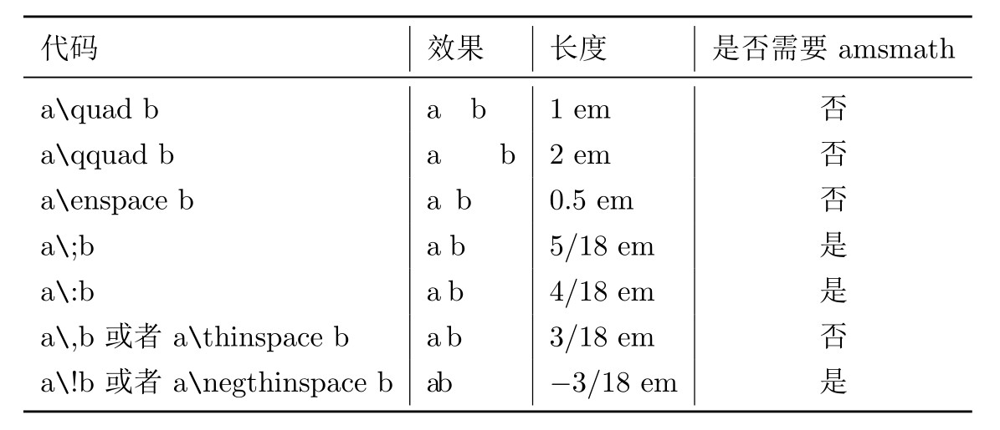
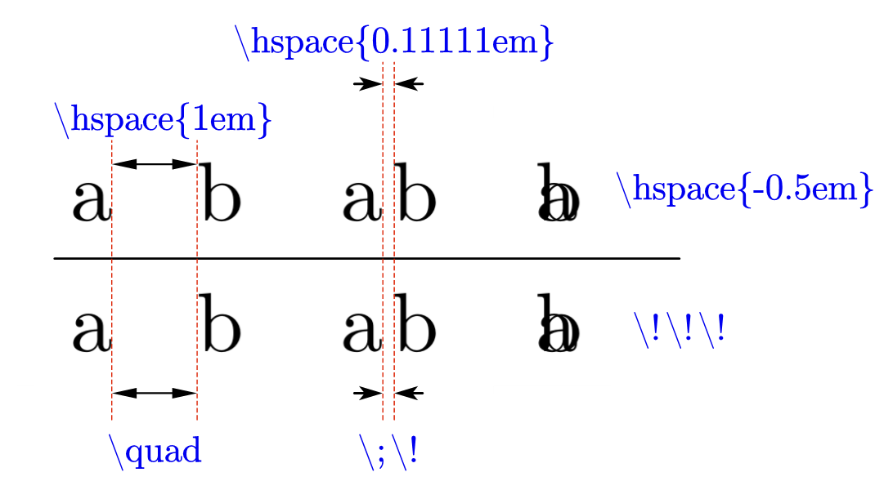
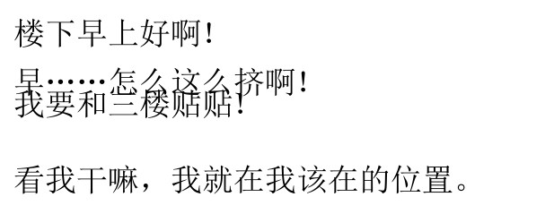
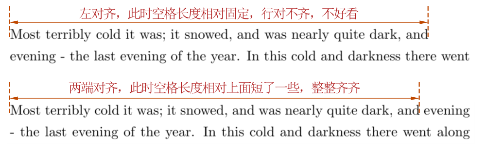
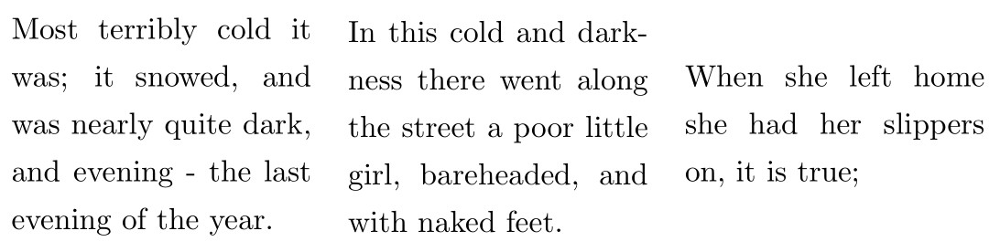

# 讲讲 Latex 让人头疼的地方

为什么科学文献通常要求用 $\LaTeX$ 书写呢？当然是因为好看呀。

$\LaTeX$ 美观的排版背后是一个庞杂的符号和排版系统，光是看看就知道这根本不是一两天能全部掌握的，就连 $\LaTeX$ 这个标题也有专门的特殊排版（看着有点奇怪，后面还是直接用 Latex 好了）。有很多符号看上去一样，但是又有十分细微的差别，比如下面的两个单词，你能看出差异吗：

$$
Microsoft \qquad Micr\omicron s\omicron ft
$$

说实话我自己也看不出来（或者我用的这个字体本身就没有区别），但上面那一行的的源码是：

```
Microsoft \qquad Micr\omicron s\omicron ft
```

后一个微软里面的 $\omicron$ 其实是希腊字母欧米克荣，而不是英文字母 $o$ ！

> 冷知识：我们用来表示高阶无穷小的符号 $\omicron$ 是希腊字母。

Latex 的精确性让它更适应于公式的排版，光是空格有多少种，就足够我写一篇了。空字符可以在我们排版时帮助我们对齐一些难以对齐的行或列，在不失 latex 美观的前提下，在细节上实现 word 一样的随意调整。~~不过遇到这种情况时，我并不推荐将空字符作为首选方案。~~了解一下 latex 的空字符还是有必要的。

<!--more-->

# 各种长度的空格

Latex 的空格种类繁多，看过来让人眼花缭乱。如果按照长度分类的话，大致可以分为下面三类。即：“只要不换字体，我一直是这么长” 的相对字体长度固定的空格，“你让我多长我就多长” 的自定义长度空格，和 “我多长取决于你把我放在哪里” 的自适应长度空格。

## 相对字体长度固定

先看相对字体长度固定的空格，这类空格最简单粗暴，你把它敲出来，它给你一段固定的留白。Latex 本身就有的这类空格并不多，`amsmath` 包则将这类空格变得更加丰富。

在往下讲之前，先说明一个长度单位： `em`. 

这个单位，常用 latex 的小伙伴肯定不陌生，但是具体含义其实众说纷纭。它并不严格地等于字体中 M 的宽度，也并不严格等于字体本身的大小，只需要知道**这个单位会随着字体变化**就行了。

常用的这类空格，以及它们各自的长度如下表所示：



有几个需要注意的点：

1. **转义符 + 标点 的组合，原则上不要在前后加空格。**相比于标准的`a\,b`，加入了空格的 `a\, b` 表现出来的空字符其实是 `\,` 加上一个常规空格。而常规空格是会适应排版进行调整的，这就导致生成的空格长度不但比想像的长，还不固定。
2. `\quad`, `\thinspace` **这类转义符 + 字母的组合，需要在后面打空格**。这时后面加入的空格不会被识别为常规空格，而是单纯作为一个命令结束的标志。但是如果空格加在了命令前面，就会被当做一个常规空格。
3. 如果上面的字符没有达到想要的长度，**可以进行组合**。比如 `\;\!` 会生成一个 2/18 em 的空格。如果还达不到要求，可以试试下面的自定义长度命令。

## 自定义长度

自定义长度的命令会生成一个给定长度的空格，使用起来十分灵活。

常用的记住 `\hspace` 和 `\vspace` 即可，前者用于水平方向，后者则用于垂直方向。这两个命令是 latex 原生的，不需要引入任何额外包。

具体使用很简单，语法是 `\hspace{<space_width>}` 在 `<space_width>` 处填入你期望的长度。

下图演示了三个使用案例及其等效的预设空格组合。其中 `\hspace{1em}` 生成的空格和 `\quad` 等长，而 `\hspace{0.11111em}` 生成的空格和 `\;\!` 等长，这里面甚至可以塞进一个负值，同时也有等长的定长空格组合与之对应。关于长度单位其实有很多可以说道的地方，比如 Latex 中的最小单位 `sp`，以及各个单位分别等于多少个 `sp` 等等，详情见这篇 [Stackexchange 上的问答](https://tex.stackexchange.com/questions/8260/what-are-the-various-units-ex-em-in-pt-bp-dd-pc-expressed-in-mm)。



而另一个 `\vspace` 可能更通用一些，通常用于行间距的微调，包括但不限于图表和标题之间、图表和正文之间、标题和正文之间的距离调整。

下面我们打一段文字：

```latex
  % ex 近似等于当前字体中 x 的高度
  楼下早上好啊！

  早……怎么这么挤啊！\vspace{-2ex}

  我要和三楼贴贴!

  \vspace{2ex}

  看我干嘛，我就在我该在的位置。
```

其效果就是这样



其实，无论 `vspace` 命令单独一行，还是和上下合并，其效果是一样的，都是在默认行距上进行加减。而相对于水平字距，行间距相对固定，因此不会带来很大的问题。

## 自适应长度

这类空格与上述不同，是以良好的排版效果作为第一优先级的。它们会随着期望的效果而改变自身的长度。

### 常规空格

这类空格中最典型的就是常规空格，敲一下键盘上那个最长的空格键，你就输入了一个常规空格。

中文文献书写中这种空格出场比较少，而英文书写中这个空格可以说是一篇文章中出现最频繁的字符了。为了排版美观，英文文献通常采用两端对齐的方式，但是英文单词又不一样长，经常出现到句尾长度不够，把下一行第一个单词拿到这一行长度又太长的情况。这时，Latex 会通过调整常规空格长度的方式来做到两端对齐。下图这句话出自《卖火柴的小女孩》。



### hfill 和 hfil

顾名思义，这两个命令可以起到填充作用。填充效果是**能延伸到的最大宽度**。通常，如果我们有张图片要并列摆放，中间就可以加上 `\hfill` 或 `\hfil`，可以把两个并排的物件中间撑开，达到一个左对齐，一个右对齐的效果。

这里用并排的 `minipage` 做个示范：

```latex
\noindent\begin{minipage}{0.3\textwidth}
    Most terribly cold it was; it snowed, and was nearly quite dark, and evening - the last evening of the year.
\end{minipage}
\hfill % 或 \hfil
\begin{minipage}{0.3\textwidth}
    In this cold and darkness there went along the street a poor little girl, bareheaded, and with naked feet.
\end{minipage}
\hfill % 或 \hfil
\begin{minipage}{0.3\textwidth}
    When she left home she had her slippers on, it is true;
\end{minipage}
```

运行效果如下。可以看到三个 `minipage` 中间被两处等长的空白分隔开了。



如果把上面两个 `\hfill` 都给换成 `\hfil`，编译出来的效果是完全一样的。但是，如果只改变其中一个，你就会发现 `\hfil` 那里的空格完全消失了。这是为什么呢？

从定义上讲，`fill` 和 `fil` 都是符合排版规则下的无穷大。但是，`fill` 是比 `fil` **更为高阶的无穷大**。如果 `\hfill` 和 `\hfil` 同处一行，那么 `\hfil` 将会被 `\hfill` 给挤成什么都没有。这一点很好理解，即使是无穷大，在更高阶的无穷大面前也是0。而等阶的无穷大，在同一行时延展出来的空格长度就是相等的了。

这两条命令同样有垂直版本，即 `\vfill` 和 `\vfil`，拓展的上限是一整页。同时，也有 `\hfilll` 和 `\vfilll`，是比两个 `l` 的 `fill` 更高阶的无穷大。这里就不多赘述了。

# 特殊空格

## 不折行的空格

有时我们需要空格前后的内容一定要在一行中显示，比如图表标题 `Fig. 3`，`Tab. 4` 这类，如果断行就很奇怪。Latex 为这种情况提供了一种不折行的空格（Non-breaking space），即 `~`。只需要写成 `Fig.~3` 即可。

## 命令后的空格

有些命令是会在文档中生成一段文字，有时候我们希望能在这段文字后面加个空格。然而无论你在命令后面打多少个空格，latex 都只会把它当成命令结束的标志，生成的文档中这段文字会和后面的文字紧紧贴在一起。

正确的解决方案是加一个转义符 `\` 再打空格，或者用 `{}` 作为命令终结的标志，来使后面的空格被识别成一个常规空格。即：

```latex
The date is \today and it's raining heavily.
% 上面这句运行的结果：
% The date is February 24, 2021and it’s raining heavily.

The date is \today \ and it's raining heavily.
The date is \today{} and it's raining heavily.
% 上面两句运行的结果是一样的，即：
% The date is February 24, 2021 and it’s raining heavily.
```

# 总结

Latex 里面的空白字符可谓琳琅满目，非一文可以穷尽。在这里我也只是汇总了一些常用的字符，基于我个人理解，有错误之处欢迎指出。

# 参考

* [Latex horizontal space: qquad,hspace, thinspace,enspace](https://math-linux.com/latex-26/faq/latex-faq/article/latex-horizontal-space-qquad-hspace-thinspace-enspace)
* [What are the various units (ex, em, in, pt, bp, dd, pc) expressed in mm](https://tex.stackexchange.com/questions/8260/what-are-the-various-units-ex-em-in-pt-bp-dd-pc-expressed-in-mm)
* [Which measurement uints should one use in latex](https://tex.stackexchange.com/questions/4239/which-measurement-units-should-one-use-in-latex)
* [Spaces and Boxes](https://www.giss.nasa.gov/tools/latex/ltx-143.html)
* [What is the difference between 'fil' and 'fill' ?](https://tex.stackexchange.com/questions/21022/what-is-the-difference-between-fil-and-fill)
