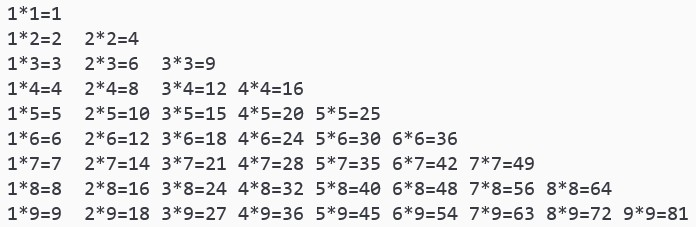
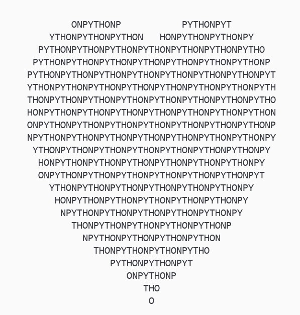
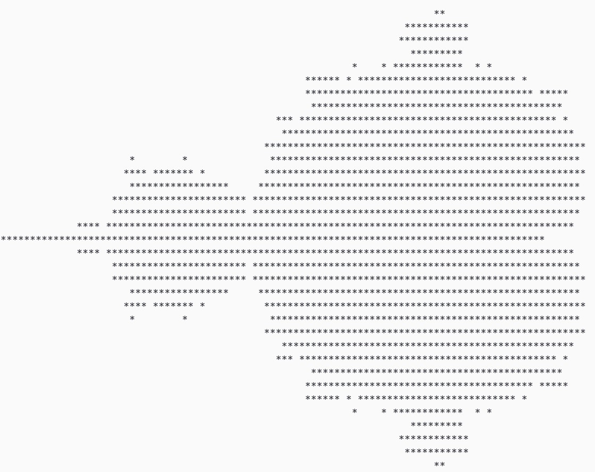

# 一行 Python 可以做到什么？

> 人生苦短，我用 Python。

简洁是 Python 的一大特点。在初学 Python 的时候，说道 Python 的简洁，最津津乐道的话题就是 “一行 Python 可以做什么”。这个话题其实涵盖相当广泛的概念，但作为一个初学者，最有冲击的自然是自己能理解的，也就是围绕 `print` 做的一些华丽操作。比如用一行代码打印九九乘法表：

```python
 print('\n'.join([' '.join(['%s*%s=%-2s' % (y,x,x*y) for y in range(1,x+1)]) for x in range(1,10)]))
```



<!--more-->

一行代码打印爱心

```python
print('\n'.join([''.join([('PYTHON'[(x-y)%6]if((x*0.05)**2+(y*0.1)**2-1)**3-(x*0.05)**2*(y*0.1)**3<=0 else' ')for x in range(-30,30)])for y in range(15,-15,-1)]))
```



甚至是分形：

```python
print('\n'.join([''.join(['*'if abs((lambda a:lambda z,c,n:a(a,z,c,n))(lambda s,z,c,n:z if n==0else s(s,z*z+c,c,n-1))(0,0.02*x+0.05j*y,40))<2 else' 'for x in range(-80,20)])for y in range(-20,20)]))
```



这些代码略有些炫技的嫌疑，但不可否认它们实现的效果确实很惊艳。不过，这些语句拆开来仔细看其实也没有什么神秘的东西，只要掌握两点：**列表解析**和 **lambda 语句**，那你也可以写出自己的“一行打印xxx”。

# 循环、条件语句是怎么合并到一行里的？

在思考这个问题之前，先来想想为什么会有这样的需求。比如我们看第一个例子，也就是九九乘法表。按照一般的逻辑，这个表应该这样打印：

```python
lines = []
for x in range(1, 10):
    formulas = []
    for y in range(1, x+1):
        formulas.append("%s*%s=%-2s" % (y, x, x * y))
    lines.append(" ".join(formulas))
print("\n".join(lines))
```

整体的结构是两层的嵌套循环，外部每迭代一次，生成一行；内部每迭代一次，生成一个算式。用 `join` 方法把算式的列表合并成行，再把行的列表合并成整个乘法表打印出来。思路十分明朗。

但是这里我们用了 7 行，不计最后的打印，我们生成的字符串用到了两行列表初始化，两行 `for` 循环，以及两行的 `join` 。那么…… 也不必发问了，毕竟开篇给出的代码已经告诉我们了：这些语句是可以被合并成一行的。这就是 Python 的**列表解析**机制，英文是 **List Comprehension**。它让我们的代码简洁很多，而且在性能上也会有所提升。

## 列表解析的基本格式

列表解析的基本语法是：

```python
[<表达式>(i) for i in <迭代器> if <条件>]
```

这句话将会把 `i` 遍历迭代器，如果符合条件就把 `i` 代入表达式中附在列表末尾。用伪代码重写一遍来理解一下：

```python
def generate_list():
    List = []
    for i in <迭代器>:
        if <条件>:
            List.append(<表达式>(i))
    return List
```

## 几个例子

最简单的，先从一个 1 ~ 10 的列表感受一下列表解析的用法：

```python
a = [i for i in range(1, 11)]
print(a)
# 上述语句打印出 [1, 2, 3, 4, 5, 6, 7, 8, 9, 10]
```

这其实没什么特别的，要生成一个 1~10 的列表，完全不需要动用列表解析器。但假如我们要写一个平方数的列表，列表解析的价值就体现出来了：

```python
a = [i*i for i in range(1, 11)]
print(a)
# 输出：[1, 4, 9, 16, 25, 36, 49, 64, 81, 100]
```

而表达式里包含的完全可以是更复杂的东西，比如函数：

```python
def factorial(n):
    # 很经典的递归教材：阶乘函数。
    if n == 0:
        return 1
    else:
        return n * factorial(n-1)

print([factorial(i) for i in range(1, 11)])
# 输出：[1, 2, 6, 24, 120, 720, 5040, 40320, 362880, 3628800]
```

乃至是对象都可以。

另外，列表解析还支持逻辑运算。如果在插入列表的时候，我们希望这个列表只包含满足一定条件的项，这就要用到后面的 `if` 了。比如，接着上面对阶乘的计算，我们只保留奇数的阶乘，就可以这样写：

```python
print([factorial(i) for i in range(1, 11) if i % 2 == 1])
```

但是不满足条件的项我们希望能用另一种方法处理后也加入列表当中，换言之，列表解析能不能加入 `else` 呢？答案是肯定的。

但是如果写成这样：

```python
print([factorial(i) for i in range(1, 11) if i % 2 == 1 else i*i])
```

Python 就会报错并且拒绝执行。

正确的做法是把 `if` 和 `else` 给提到循环的前面：

```python
print([factorial(i) if i % 2 == 1 else i * i for i in range(1, 11)])
```

这样才能实现一个奇数算阶乘，偶数算平方的列表。

最后，列表解析是完全支持嵌套的，也就是列表解析最前面的`<表达式>`是完全可以包含另一个列表解析器的。这就是上面九九乘法表的实现原理。在回来看最开始写的两层循环，我们将其一层层封装起来，看列表解析是怎么简化表达的：

```python
# 原本的代码
lines = []
for x in range(1, 10):
    formulas = []
    for y in range(1, x+1):
        formulas.append("%s*%s=%-2s" % (y, x, x * y))
    lines.append(" ".join(formulas))
print("\n".join(lines))

# 内部用列表解析简化：
lines = []
for x in range(1, 10):
    lines.append(" ".join(["%s*%s=%-2s" % (y, x, x * y) for y in range (1, x+1)]))
print("\n".join(lines))

# 再将外部的迭代简化掉：
print("\n".join([" ".join(["%s*%s=%-2s" % (y, x, x*y) for y in range(1, x+1)]) for x in range(1, 10)]))
```

上面会输出三组一模一样的乘法表，这就 OK 啦!

对于打印爱心的操作，只要利用 `if` `else`，那就不是什么困难的问题。

# 神奇的 lambda

仅仅依靠列表解析可以解决九九乘法表，但是对于 [Manderbrot 集（曼德布罗特集）](https://baike.baidu.com/item/曼德勃罗集/4888291?fr=aladdin)这种需要不断迭代来判断是否在集合内的图案，单纯的列表解析就有点乏力了。我们完全可以在外部定义一个判断每个点是否在集合内的函数，但如果就是想写在一行以内，又该怎么办呢？开头的代码出现了四次的单词 `lambda` 就是我们的答案。

## lambda 究竟是什么？

`lambda` 是一种匿名函数的定义标志。匿名函数就是没有名字的函数。基本语法是：

```python
lambda argument_list: expression
```

注意：上面的表达式将会返回一个**函数**，冒号的前后分别是这个函数的**输入参数列表**和**返回值**。我们拿最简单的索引来举个例子：

```python
L = [1, 2, 3, 4]
f = lambda x : x[0]
print(f(L))
print((lambda x : x[0])(L))
# 两个语句都会输出 1，也就是 L 的第一个元素。
```

这里的 `lambda` 就定义了一个输入为 `x` ，输出为 `x[0]` 的函数，等价于下面的函数定义：

```python
def f(x):
    return x[0]
```

OK，下面来观察一下案例中那串老长老长的 `lambda` 语句：

```python
(lambda a:lambda z,c,n:a(a,z,c,n))(lambda s,z,c,n:z if n==0else s(s,z*z+c,c,n-1))(0,0.02*x+0.05j*y,40)
```

这条只有一行的语句浓缩了 lambda 的很多技巧，有些甚至我自己也是第一次见。这句话虽然看着麻烦，但仍然值得仔细品味。

## lambda 的嵌套

有三个括号，看着很是头疼。我们从里到外，一个一个来看。首先，第一个括号里就出现了两个 lambda。这里就是 lambda 的嵌套，也就是在一个 lambda 表达式中引用另一个 lambda 表达式。

先看内层：

```python
lambda z,c,n:a(a,z,c,n)
```

这里 `z`, `c`, `n` 是参数，返回值是 `a(a, z, c, n)`，所以这个函数写成不匿名的形式就是：

```python
def f1(z, c, n):
    return a(a, z, c, n)
```

可是这里多了一个 `a` 啊！我们看看 `a` 是什么，注意到前面的 `lambda a :`，实际上 `a` 就是外层函数的输入参数，把这个函数也给包起来，那就是：

```python
def f2(a):
    return f1
# 如果考虑到实际执行，应该把 a 也写进 f1 的参数里，但这里仅仅是伪代码，为了展示输入和输出的，所以就不做这么严谨啦 :-3
```

接下来那么我们看第二个括号：`(lambda s,z,c,n:z if n==0else s(s,z*z+c,c,n-1))`。这里为什么会有个括号呢？相信自己对 Python 的理解，首先排除相乘。这里的括号作用其实是**函数的调用**。可能有点难理解，但用上面的 `f2` 把 `lambda` 表达式替换掉再写一遍呢？

```python
f2(lambda s,z,c,n:z if n==0 else s(s,z*z+c,c,n-1))
```

这个形式就其内部参数是一个函数，也正好符合 `a` 的使用形式。我们记上面那个函数是 `f3(s, z, c, n)`，那么，整个函数用非匿名的方式改写就是：

```python
f2(f3):return f1: return f3(f3, 0, 0.02*x+0.05j*y, 40)
```

再重复一遍几个函数的关系：`f2` 接收函数 `f3` 作为参数输入，返回函数 `f1`，`f1` 再接收最后一个括号里的三个参数作为输入，返回数值。

## lambda 实现递归

在研究 `f3` 里面 `s` 的作用，最终发现它竟然作为一个中间量实现了递归时，我感到十分震撼.jpg (但是看懂了)

众所周知，递归函数是指调用其本身的函数。但是 lambda 有个什么问题呢？对，它根本就没有名字，在定义好之前要怎么调用呢？难道要重新写一遍吗？

```python
lambda x: lambda x: lambda x: ...
```

好像不行…… 换个思路。虽然 lambda 定义的本身是匿名的，但在 lambda 函数内部，传进的参数可是有专门的名字的哦。利用这一点，借助其它 lambda 的帮助，递归就可以实现了。

为了说明这一点，我们把 `f3` 的定义给写明白：

```python
def f3(s, z, c, n):
    if n == 0:
        return z
    else:
        return s(s, z*z+c, c, n-1)
```

这里 `s` 是作为函数被调用的，同时也作为参数传入 `s`。也就是这里，`s` 既是函数，也是它自己需要的参数。往回看，`f3` 被传进 `f2`，在 `f2` 中影响 `f1` 的内部运算。对，其实这里的 `s` 就是第一个括号里面的 `a`。

现在你可能发现了，所有的函数，这样一层层嵌套，都是为了写出这个递归。`f3` 定义了递归的结构，`f1` 和 `f2` 则分别接收递归初始值和递归主体函数。可以理解为，`f3` 到了 `f2` 内就有了名字，就可以做到将它自己塞进它的第一个参数位置，这样返回得到一个函数就是 `f1`，也就是一个有递归功能的正常函数了。

于是，这个冗长的 lambda 所做的事情就是对给定范围内的每一组 `(x, y)`，按照

$$
z_0=0,\quad c = 0.02x+0.05jy,\quad  
z_{k+1} = z_{k}^2 + c
$$

的关系迭代到 $z_{40}$ 如果 $\|z_{40}\|<2$ 则将该位置填充成 `*`，否则将该位置留白为空格。这就得到了熟悉的分形。

Mandelbrot 集的运算详情见[这里](https://baike.baidu.com/item/%E6%9B%BC%E5%BE%B7%E5%8B%83%E7%BD%97%E9%9B%86/4888291?fr=aladdin)。

# 现在你也可以开始秀操作啦！

现在相信你已经对列表解析和 lambda 表达式有了更深入的理解了，那么想要用一行 Python 去打印你想要的图案也不是什么困难的事情了。总结起来就是：

1. 定义一个函数来判断那些坐标应该打印什么，并用 lambda 压缩成一行；
2. 用列表解析将遍历坐标的过程压缩到一行。

虽说这种过度的压缩对于代码可读往往并没有什么提升，但这其中的两个主要思想：列表解析和 lambda 表达式，却是每一个 Python 开发者都需要或多或少地了解乃至掌握的。

最后的最后，不得不提一提最经典的 one-liner，这句话熔铸了 Tim Peters 对于 Python 的情感。这就是著名的 Python 之禅（Zen of Python），第一次听说的朋友不妨试一试:

```python
import this
```

# 参考

* [一行Python代码能做什么？ - 知乎 (zhihu.com)](https://zhuanlan.zhihu.com/p/28726375)
