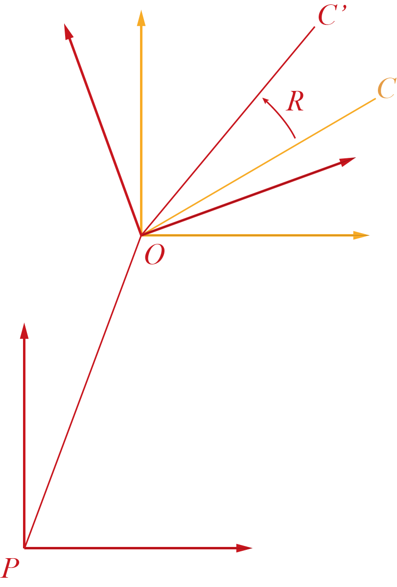

## BVH简介

BVH 是 BioVision 公司推出的一种人体动作捕捉文件格式。这种文件以节点为核心元素，记录连续数帧内人体骨架的运动。

### BVH=？

研究一个东西的时候我比较喜欢先研究它的名字。BVH 可以认为是 *BioVision Hierarchy* 的缩写，因为这类文件对节点的组织是按照树形结构来的，也就是层次化 (hierarchical) 的。关于这个名字还有另一种可能的解释：如果你去查询 Blender 的文档，对 BVH 的介绍则将其等同于 *BioVision Motion Capture*. 我倾向于前者，因为 **hierarchy** 这个词其实揭示了 BVH 的本质。

把这类文件叫做BVH有一个最单纯最直接的原因，那就是 `.bvh` 是所有这类文件的统一后缀|·ω·)

## 文件结构

文件分为两大部分，**层级结构**和**运动信息**。下面是 BVH 的一个示例：

<!--more-->

```bvh
HIERARCHY
ROOT Hips
{
    OFFSET  0.00    0.00    0.00
    CHANNELS 6 Xposition Yposition Zposition Zrotation Xrotation Yrotation
    JOINT Chest
    {
        OFFSET   0.00    5.21    0.00
        CHANNELS 3 Zrotation Xrotation Yrotation
        JOINT Neck
        {
            OFFSET   0.00    18.65   0.00
            CHANNELS 3 Zrotation Xrotation Yrotation
            JOINT Head
            {
                OFFSET   0.00    5.45    0.00
                CHANNELS 3 Zrotation Xrotation Yrotation
                End Site 
                {
                    OFFSET   0.00    3.87    0.00
                }
            }
        }
        JOINT LeftCollar
        {
            ...
        }
    ...
}

MOTION
Frames：    2
Frame Time： 0.033333
 8.03    35.01   88.36  -3.41    14.78  -164.35  13.09   40.30  -24.60   7.88    43.80   0.00   -3.61   -41.45   5.82    10.08   0.00    10.21   97.95  -23.53  -2.14   -101.86 -80.77  -98.91   0.69    0.03    0.00   -14.04   0.00   -10.50  -85.52  -13.72  -102.93  61.91  -61.18   65.18  -1.57    0.69    0.02    15.00   22.78  -5.92    14.93   49.99   6.60    0.00   -1.14    0.00   -16.58  -10.51  -3.11    15.38   52.66  -21.80   0.00   -23.95   0.00   
 7.81    35.10   86.47  -3.78    12.94  -166.97  12.64   42.57  -22.34   7.67    43.61   0.00   -4.23   -41.41   4.89    19.10   0.00    4.16    93.12  -9.69   -9.43    132.67 -81.86   136.80  0.70    0.37    0.00   -8.62    0.00   -21.82  -87.31  -27.57  -100.09  56.17  -61.56   58.72  -1.63    0.95    0.03    13.16   15.44  -3.56    7.97    59.29   4.97    0.00    1.64    0.00   -17.18  -10.02  -3.08    13.56   53.38  -18.07   0.00   -25.93   0.00  
```

该文件是删减过的，为了显示清楚格式。[>点我<](https://research.cs.wisc.edu/graphics/Courses/cs-838-1999/Jeff/Example1.bvh) 看源文件。

### 层级结构

首先 `HIERARCHY` 标记了层级结构部分的开始。

可以跟着编译器的思路来理解这一部分：

* 现在开始读这个文件啦，首先读到的是 `ROOT`，这表示第一个节点是根节点。第一个节点总是根节点；
* 往下读，读到了 `Hips` 这个词，结合上一条的信息，我们就知道了，根节点的名字是 'Hips'。对于人体骨架来说，根节点一般都取在 Hips 也就是臀部。
* 接着，出现了 `{`，左括号开始了，必然有右括号 `}` 与之闭合，而括号之间的部分，既有节点，也有信息。我们可以理解为括号括起来的部分从属于刚刚读到的节点，这里是根节点 `Hips`。
* 下面读到一个关键字 `OFFSET`。接下来会有三个数字，这里是 `0.00 0.00 0.00` 这表示该节点相对于父节点的偏移，也可以理解为从父节点到该节点连线所表征的向量。根节点没有父节点，所以这里是 **0**.
* 再读，读到 `CHANNELS `这个关键词，那么这一行剩下的部分就是几个表示自由度的关键字，`Xrotation` `Yrotation` `Zrotation`表示了三个旋转自由度，`Xposition` `Yposition` `Zposition` 表示三个平移自由度。这一行表示刚才的根节点的自由度信息。
  * 一般来说，根节点有全部的 6 个自由度，而其余节点只有 3 个旋转自由度。
  * 这些自由度的具体含义会放在后一节说明。
* 接着往下，读到了 `JOINT`  这个关键字，这意味着这一行表示的是一个节点，后面的一个词 `Chest` 则是这个节点的名字。这个节点和根节点唯一的区别就是标记是 `JOINT` 而不是 `ROOT`。
* 下面又出现了 `{`，同样的，括号内的信息和子节点都从属于该节点。
* 直到 `End Site` 出现前的部分都不需要赘述。`End Site` 是一个无名节点，表示树形结构到这里就是叶节点啦，后面再也没有子节点了。`End Site `没有子节点，所有也就没有自由度信息，只有相对父节点的偏移信息。
* 接下来读到了本文件第一个 `}`，表示一个节点的所有范围终结。
* 下面再出现 `JOINT` 标记的节点时，我们回去找它在谁的括号内，它就是谁的子节点，以此类推，直到 `MOTION` 结束，因为这是下一部分开始的标志。
  
  

### 运动信息

紧承前节，看到了 `MOTION` 这个关键字，就代表着运动信息的部分开始了。

这一部分的结构要简单的多，就不像上一节那样介绍了：

* 第二行 `Frames：    2` 表示帧数，这里是2帧；
  * 这里的帧数必须与后面的帧数据行数相等，因为这个数字决定了要读取多少行，如果少了会造成数据浪费，多了就会出bug
* 第三行 `Frame Time： 0.033333`  表示每一帧的持续时间，这里是 $\frac{1}{30}\text{s}$，也就是这个文件是 30 FPS
* 后面有n行运动数据，每行为一帧。这些信息按照 `HIERARCHY` 部分的自由度出现的顺序一一对应。其中角度的单位是度(°)
  
  

## 运动计算

这一部分主要解决的问题是：如何通过 BVH 复现运动情况。这种旋转还是很抽象，要转化就要转化成人最方便理解的形式，那就是三维坐标。

### 自由度理解

首先要明确的是，这些参数的含义究竟是什么。

如果在根节点 `ROOT` 建立全局坐标系，把 `OFFSET` 都作为相对这个全局坐标系的向量，那么仅凭 `HIERARCHY` 的信息是可以画出一个基本的骨架的。把这个骨架图起个名字叫 $G_0$，后面还要再提到它。这种生成 $G_0$ 的方法理论上没有问题，但是不能这么理解。BVH 中每个节点都有自己的局部坐标系，所有的变换都是在局部坐标系完成的。只不过在 $G_0$ 中，这些坐标系全部平行，局部坐标就等于全局坐标。

注意，虽然这里我们画出了 $G_0$，但这并不是初始的那一帧，只是一个基本的参考。运动信息部分中的每一帧都可以由这一帧的信息和 $G_0$ 唯一地生成，**没有记忆性**，也就是说每一帧都是独立的。

BVH 的每个节点都有 3 个或 6 个自由度，这些自由度都是相对于初始坐标系（暨全局坐标系）而言的。平移自由度很好理解，就是沿着三个轴的偏移量；而旋转自由度则需要牵扯到 3 个点：当前节点 O、子节点 C、父节点 P。如下图



这里要第一次强调 **hierarchy** 的含义了：每个节点的旋转，在自己的坐标系旋转的同时，带动所有子节点和相关骨骼的旋转。可以理解为按照层级从根到叶先后执行旋转，一个节点的局部坐标在旋转之前，始终和其父节点的局部坐标保持平行。

按照这样一个过程，我们来理解一下旋转自由度的含义。在节点 $O$ 旋转前，其局部坐标系 $Oxyz$ 是和 $Pxyz$ 完全平行的。三个自由度的含义是先后绕局部的 $Oz$, $Ox$, $Oy$ 旋转的角度（这里以 ZXY 顺序为例）。注意，这里的单位是**度（°）**.

旋转的结果不会体现在节点 $O$ 上，而是体现在 $C$ 及其后续节点的位移，即向量 $\vec{OC}$ 的旋转。

### 递归计算

这一部分主要讨论如何利用 BVH 中给出的信息，计算出每一帧所有节点的三维坐标序列。其核心是坐标变换的递归。

这里要再一次强调 **hierarchy** 这个词。递归计算的核心就是对层级结构的利用。

我们知道，如果一个坐标系 $p$ 旋转之后得到了坐标系 $q$，这一旋转过程的旋转矩阵可以表示为 $R_{pq}$，而在这个空间内有一定点 $A$，它在两个坐标系下的坐标分别是 $A_p$ 和 $A_q$,那么有如下关系成立：

$$
A_p = R_{pq}A_q
$$

这就是**坐标变换公式**。

这里就有问题了。BVH 中的旋转是向量在旋转，这个公式中 $A$ 点根本就是一个定点，怎么能用来计算呢？

其实在前一节，我们赋予了每个点一个单独的局部坐标系，并规定这个坐标系内，直接后继的坐标是不变的。这就是为了将坐标变换和向量旋转等同。可以分几步来理解这个计算过程（以父节点的坐标系为基准）：

1. 转之前的橙色坐标系（$\vec{OC}$所在的坐标系）记为 $p$， 转之后的红色坐标系（$\vec{OC^\prime}$）记为 $q$。

2. 旋转前，所有坐标系都与全局坐标系等同，这就使得 $\vec{OC^\prime_p}$ 实质上是 $\vec{OC^\prime}$ 在全局坐标系下的坐标，也就是我们直接可以从坐标序列得出的 $V_g$。旋转后的坐标系下，同一个向量 $\vec{OC^\prime}$ 在 $q$ 下的坐标实质上是基准帧内该向量的坐标，即 $V$。

3. 于是有了
   
   $$
   \boldsymbol{V}_g=R\boldsymbol{V}
   $$

我们再来理解递归的过程：在基准帧，当前节点以其父节点为基准执行旋转，得到向量 $R_n\boldsymbol{V}$，这一向量的坐标是相对其父节点而言的；那么以父节点作为待处理的节点，继续执行这个过程，有了 $R_{n-1}R_n\boldsymbol{V}$，以此类推。于是，某一节点的局部坐标到全局坐标的转化矩阵就可以写为

$$
R=R_0R_1R_2\cdots R_n
$$

为了不让这个式子看起来太复杂，我没在公式里显式指明旋转矩阵所在节点的从属关系。但是他们之间的关系应为：$R_{i+1}$ 是 $R_i$ 的子节点。

有了这个关系，$R_n$ 就可以递归求解。即，当我们知道 $R_n$ 节点所有祖先节点的旋转矩阵，他们按照上面的顺序乘在一起得到的结果是 $R_m$, 则成立以下式子：

$$
\boldsymbol{V}_g=R_mR_n\boldsymbol{V}
$$

式中只有 $R_n$ 是未知的。

## The End

最近在学习人体的动作捕捉，BVH 和 ASF / AMC 是两种通用的并且以旋转为核心的格式。下一篇文章应该会用来讲后者，顺便做一做比较。当然也可能鸽；）

文章内容依然是基于我个人理解，如有错误，万望指正。

开学了，要收拾好心情：）
