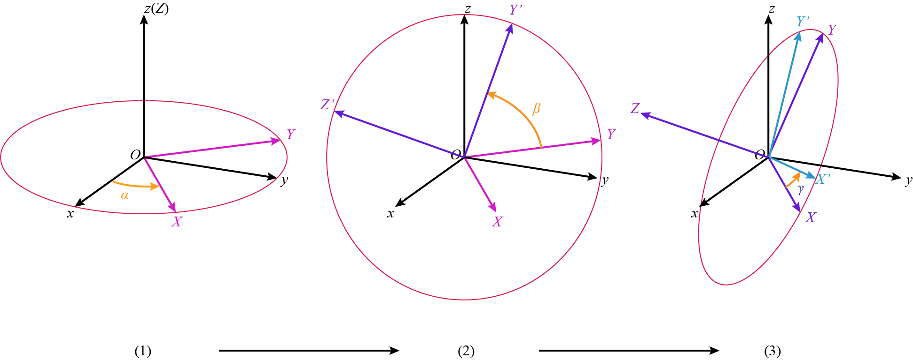
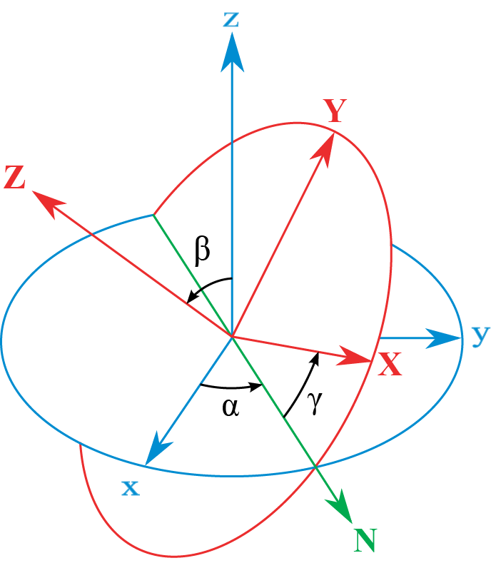

## 欧拉角定义

欧拉角 (Euler Angle)，由著名数学家莱昂哈德·欧拉 (1707-1783) 提出，故而得名。欧拉角旨在用三个角度来表示刚体在三维空间的旋转。这种表示方法经历了3个世纪，其实已经非常古老了，自身有一些局限性，塞利斯基 (Richard Szeliski) 所著《计算机视觉：算法与应用》一书中对欧拉角甚至只是一笔带过。但是欧拉角现在依然在广泛使用，因此仍然有深入学习的必要。

首先我们统一符号:

+ $Oxyz$ 是世界坐标系，是固定不变的。
+ $OXYZ$ 是被旋转的局部坐标系。

欧拉角的定义分为静态定义和动态定义。百度上说的很复杂，两种定义方式并没有给出很明确的区分，但是对我们计算需求而言，只需要一点区分就可以了，那就是：旋转是基于全局坐标系还是局部坐标系。

### 基于局部坐标系的旋转

有点“我绕着自己转”的意思。

最典型的欧拉角旋转为 $z-X-Z$ 顺序，即刚体先后绕 $z, X, Z$ 轴旋转角度 $\alpha, \beta, \gamma$。注意字母**大小写**，即最开始是绕全局坐标系的 $z$轴 旋转，之后按顺序绕自己局部坐标系的 $X$ 轴和 $Z$ 轴旋转，考虑到最开始两个坐标系是重合的，即 $z=Z$，这种旋转顺序也可以理解为 $ZXZ$。

<!--more-->

这种旋转的流程如图所示。每张图中的红色椭圆代表了旋转轴的法平面。

在维基百科的对欧拉角的解读中，有一张将过程整合的图，百度上也有但是清晰度要差很多。

### 基于全局坐标系的旋转

这种旋转非常好理解，世界坐标系是不变的，刚体的局部坐标系先后绕三个固定的轴作旋转，就是这种欧拉角的效果了。同样的，用分布图解来看，下图显示了顺序为$z-x-y$的欧拉角所展示的结果：



## 三维旋转矩阵

### 基本旋转矩阵

如果考虑一个很简单的旋转，这个旋转简单到只是绕着某个坐标轴旋转一个角度 $\theta$，绕着转的坐标轴所对应的坐标就不会有任何变化，而我们已经知道，二维平面的旋转矩阵是这样的：

$$
R(\theta)=\left[\begin{matrix}
\cos\theta & -\sin\theta \\
\sin\theta & \cos\theta \\
\end{matrix}\right]
$$

那第三个维度只要保持不变就好了。这就不难理解绕着三个基本坐标轴旋转特定角度所对应的旋转矩阵：

$$
R_x(\psi)=\left[\begin{matrix}1 & 0 & 0 \\0 & \cos\psi & -\sin\psi \\0 & \sin\psi & \cos\psi\end{matrix}\right]
$$

$$
R_y(\theta)=\left[\begin{matrix}
\cos\theta & 0 & \sin\theta \\
0 & 1 & 0 \\
-\sin\theta & 0 & \cos\theta
\end{matrix}\right]
$$

$$
R_z(\varphi)=\left[\begin{matrix}
\cos\varphi & -\sin\varphi & 0 \\
\sin\varphi & \cos\varphi & 0 \\
0 & 0 & 1
\end{matrix}\right]
$$

至此，有一个十分关键的点，就是这三个旋转矩阵的适用前提都是**刚体的旋转轴是定义坐标时用的坐标系**。这很好理解，毕竟这几个矩阵乘以三维向量后，都会有一个坐标值是不改变的，那么旋转就一定是绕这个轴进行的。

## 旋转矩阵和两种欧拉角

这里的两种欧拉角并不是指两种定义方式，而是上面说的两种参照，是绕自己的轴转，还是绕全局的轴转。

除了旋转方式的差异，我们所诉求的坐标不同也会导致结果的不同。有两种诉求：转向量和转坐标系。前者是旋转向量，同时带动向量的局部坐标系旋转；后者则是旋转局部坐标系，待求的向量在全局坐标系下是保持不变的。有趣的是，如果在转向量时，把局部坐标系作为我们的参考，那么就可以等效为响亮不动而转坐标系的情况。下面先说点固定不动，而转坐标系的情形下，怎么求**局部坐标的变换矩阵**。

规定一些事情以便比较：

* 最开始全局坐标系和局部坐标系是重合的；
* 旋转的顺序都是 $xyz\; (XYZ)$
* 旋转角保持和前面一节一致：分别是 $\psi, \theta, \varphi$.

### 绕局部坐标轴旋转

如果旋转是绕着局部坐标系进行的，所有的坐标又都是或可以看成局部坐标系，那么我们就可以当全局坐标系不存在。假设变换前后的固定点在局部坐标系下的坐标分别是 $P_0$ 和 $P_1$.

第一步绕x轴旋转$\psi$角度，对应的旋转矩阵即为两者之间的坐标变换矩阵：
$$
R_xP_x=P_0
$$

注意变换矩阵的位置，是乘在变换后的$P_x$的左边。同理：

$$
R_yP_{xy}=P_x
$$

$$
R_zP_{xyz}=P_{xy}
$$

其中 $P_{xyz}=P_{1}$.

三个式子迭代，就得到了
$$
R_xR_yR_zP_1=P_0
$$
两者之间最终的坐标变换矩阵最终是这样的：
$$
R_{local}=R_xR_yR_z
$$
反直觉的是，如果把 $P_1$ 和 $P_0$ 的关系换一种方法写：
$$
P_1=R_z^TR_y^TR_x^TP_0
$$
分开的三个矩阵的作用顺序是指定的 $x-y-z$，但他们是以转置，也就是逆矩阵的形式作用在 $P_0$ 上的。

下面问题来了，是不是绕全局坐标系旋转，他们就会以原形式作用呢？往下看。

### 绕全局坐标轴旋转

如果我们分步来看这个过程，会发现绕$x$的轴旋转完成后，两个坐标系不重合，我们的坐标都是被旋转的局部坐标系下的，而前面给出的绕坐标轴的旋转矩阵能够作用的前提是**转轴是定义坐标所使用的坐标系的坐标轴**，这一条件不成立，就无法使用上面的简单形式。
问题的本质是得到每一步相应的旋转矩阵。第一步与绕局部坐标旋转的情形无异：
$$
R_xP_x=P_0
$$
然而，接下来就不能直接用前面求得的 $R_y(\theta)$ 了，因为旋转轴不是局部坐标系的 $Y$ 轴了。我们需要把全局坐标系的 $y$ 轴正方向在局部坐标系中用单位向量 $\boldsymbol{n}_y$ 表示出来，经过旋转我们很好求得：
$$
\boldsymbol{n}_y=R_x^T\left[0\quad 1\quad 0\right]^T \\
$$
第二步的坐标变换矩阵就变成了绕 $\boldsymbol{n}_y$ 旋转角度 $\theta$。对应的旋转矩阵很好计算但形式会比较复杂，记为 $R_{xy}$，那么第二步的转化可以写成
$$
R_{xy}P_{xy}=P_x
$$
同理，最后一步，需要得到两步旋转后全局$z$轴同向的 $\boldsymbol{n}_z$.
$$
\boldsymbol{n}_z=R_{xy}^TR_x^T[0\quad 0\quad 1]^T
$$
绕 $\boldsymbol{n}_z$ 旋转角度 $\varphi$ 的矩阵是 $R_{xyz}$，那么
$$
R_{xyz}P_{xyz}=P_{xy}
$$
坐标变换矩阵就是：
$$
R_{global}=R_xR_{xy}R_{xyz}
$$
~~这可比上一种情形要复杂得多，这也是为什么一般都用欧拉角的静态定义。~~

#### 勘误

实际上绕全局固定坐标系旋转的欧拉角可以有更好的表达形式，上述的表达我认为是对的，但是没有什么实际意义。正式应用中，这种绕全局坐标轴旋转的欧拉角叫做 "RPY" (Roll, Pitch, Yaw)。先给出旋转矩阵的形式（按照 $x-y-z$ 的顺序旋转）：
$$
R_{global}=R_zR_yR_x
$$
证明的话，可以从坐标变换的根本出发，即基底变换。全局坐标系的基底为：
$$
[\boldsymbol{\varepsilon}_1\quad\boldsymbol{\varepsilon}_2\quad\boldsymbol{\varepsilon}_3]=
\left[\begin{matrix}
1 & 0 & 0 \\
0 & 1 & 0 \\
0 & 0 & 1
\end{matrix}\right]
$$
在全局坐标系中的坐标为

三个基底都可以作为单独的向量。在对目标局部坐标系进行旋转时，对每个基底的旋转是等同的。最开始，目标基底和全局基底相等。本质上是对向量的旋转，以 $\boldsymbol{\varepsilon}_1$ 为例，首先绕x轴旋转，得到了 $R_x\boldsymbol{\varepsilon}_1$ 为新的基向量；下一步绕 $y$ 轴旋转，得到了 $R_y(R_x\boldsymbol{\varepsilon}_1)$；最后得到的是
$$
\boldsymbol{\varepsilon}_1^\prime=R_zR_yR_x\boldsymbol{\varepsilon}_1
$$
因此，我们可以发现基底的变换满足：
$$
[\boldsymbol{\varepsilon}_1^\prime\quad\boldsymbol{\varepsilon}_2^\prime\quad\boldsymbol{\varepsilon}_3^\prime]=R_zR_yR_x[\boldsymbol{\varepsilon}_1\quad\boldsymbol{\varepsilon}_2\quad\boldsymbol{\varepsilon}_3]
$$
这就可以直接作为坐标系之间的旋转变换关系了。

事实上，考虑到 $[\boldsymbol{\varepsilon}_1\quad\boldsymbol{\varepsilon}_2\quad\boldsymbol{\varepsilon}_3]=I$，上面的等式可以表达为更简单的形式：
$$
[\boldsymbol{\varepsilon}_1^\prime\quad\boldsymbol{\varepsilon}_2^\prime\quad\boldsymbol{\varepsilon}_3^\prime]=R_zR_yR_x
$$
如果我们进一步想由此写出坐标转换关系，那么根据基底和坐标的关系：
$$
[\boldsymbol{\varepsilon}_1^\prime\quad\boldsymbol{\varepsilon}_2^\prime\quad\boldsymbol{\varepsilon}_3^\prime]P_1=[\boldsymbol{\varepsilon}_1\quad\boldsymbol{\varepsilon}_2\quad\boldsymbol{\varepsilon}_3]P_0
$$
即
$$
R_zR_yR_xP_1=P_0
$$

### 转向量的情形

针对向量的旋转问题中，我们更多关注的是：一个向量 $P_0$ 经过指定的旋转之后，得到的向量在原坐标系下的坐标 $P_1$。如果绕全局坐标系旋转，这个转换就很直接了（依然是按照 $x-y-z$)的顺序：
$$
P_1=R_zR_yR_xP_0
$$
而如果我们在转动向量的时候，是以其局部坐标为基准的（不要以为这种~~反人类的~~旋转方式不存在，事实上，BVH 中的节点旋转就可以说是这么定义的），那么可以逆向思考，即把这个旋转问题转化为坐标转换矩阵的求解。如果我们以局部坐标系为参考，那么旋转过程中向量的坐标是不变的，旋转等价于绕固定的三个轴对全局坐标系作**方向相反**的旋转。根据上面的求解的结果，我们知道坐标转换关系是：
$$
R_z^TR_y^TR_x^TP_1=P_0
$$
于是：
$$
P_1=R_xR_yR_zP_0
$$

## The End

这四种情形之间关系很密切，非常的绕……由于之前在处理 BVH (BioVision Hierarchy) 文件时，一直对文件里的三轴旋转理解有问题，所以查了很多资料，整理了一下。

本文基于个人理解，可能会有错误；~~如有雷同，是他抄我~~ ，怎么会雷同呢，真是的:-/

三张图片，除了第二章整合过程图是在[维基百科](https://commons.wikimedia.org/wiki/File:Euler.png)上下载的，其他的两张分步过程图都是原创，要使用的话请注明出处：）

Thx.
