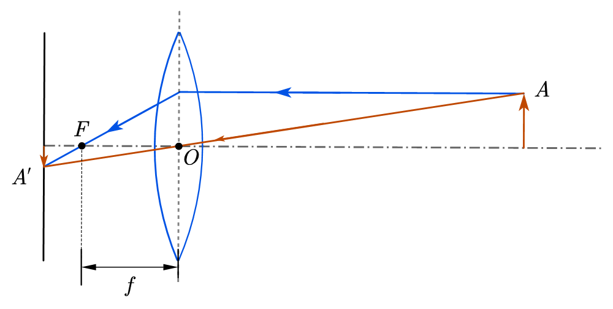
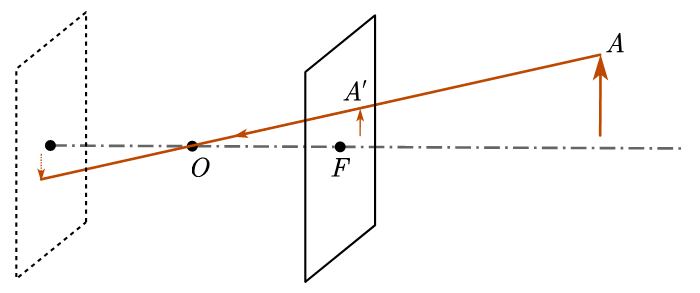
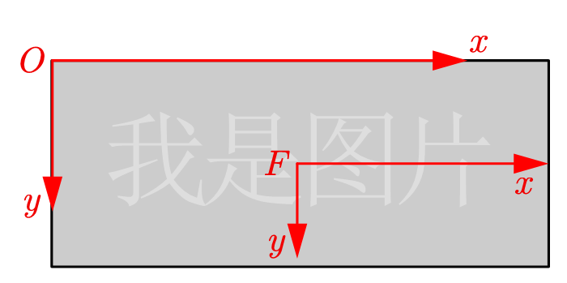
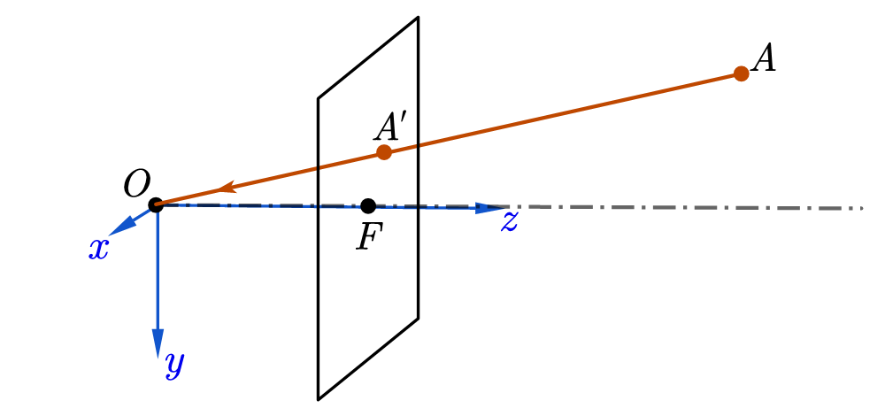
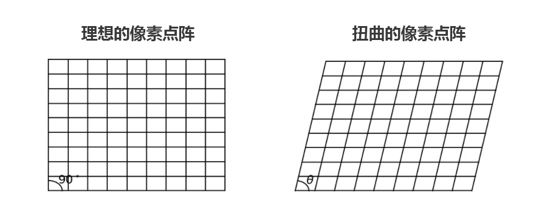

# 前言

“相机就是计算机的眼睛。”

—— <del>哲学砖家阿瓦里斯基</del> 好吧是我说的

这句话其实仅代表的是我的观点，相机之于计算机正如眼睛之于人，人眼就可以看成两台精密的相机。不过，不同于人眼的随时调节，对人造的相机，其各项参数就相对固定，易于调节，这也为 CV 的研究提供了方便。相机的参数是 CV 里一项很重要的基础课，我在这里会尽量讲的浅显易懂。

<!--more-->

# 相机模型 —— 从小孔成像说起

## 说起来，这是初中物理就开始学的吧

说到我们最早接触的光学成像模型，应当是小孔成像模型了。它原理很好理解，而且实验材料很容易搞到手。只要一张白纸和一个有孔的不透光薄片。将它们并排放置，再在薄片的另一侧放一个光源，就可以在白纸上看到光源的像了。

而相机则是参考了人眼的构造，使用透镜来汇聚光线使成像更加清晰。尽管模型更加复杂，我们还是可以在图中看到小孔成像的影子。

从物体上射出的很多光线中，有一条始终穿过光心，这很像小孔成像的原理，而这就是相机**针孔模型（Pinhole Model）**存在的基础。尽管现实中的相机远比小孔成像要复杂的多，还会存在或多或少的畸变，但现阶段，我们并不需要考虑这些。

## 模型概览

不知大家有没有听说过 “傻瓜相机”。这种相机的焦距极短，外面的物体，无论远近，成像都近似在焦距附近。我们只要在焦点哪里竖起胶卷，就可以将外界的影像清晰地记录下来。不需要调焦，所有的操作就是按下快门，所以它就有了这个名号。

我们的模型和这个十分类似，我们的像平面放在焦点上，如果想找到成像点，只要把物体和相机光心连一条线就可以了。

不过，这里我们玩了一个小 trick：我们知道，小孔成像成的是**倒像**，倒像研究起来多难受啊，于是我们沿着光线把像平面往前推，推到对称的另一个焦点上。这个时候，成像点的确定依然是目标点和光心连线与像平面的交点，但是我们不再需要延长了，成像也变成了正像。不过要注意的是，这么做只是为了研究方便，实际上放在这里的像平面是无法成像的（准确的说，是成 “虚像”）。

这就是相机的**针孔模型**，原理上类似于傻瓜相机，理解起来类似于小孔成像，研究起来…… 嘛，知道基本的几何构造就够了。

## 模型坐标系

为了讨论模型的参数，最重要的是将这个模型量化，这就牵扯到坐标系如何建立。

本问题中，牵扯到的坐标系有 3 个：**世界三维坐标系，相机局部三维坐标系和图形二维坐标系**。

先从最熟悉的图像坐标说起。在学习图像坐标系的时候，最经典的坐标系是把原点放在图像的左上角，$x$ 轴向右，$y$ 轴向下。下面的 $Oxy$ 就是这样一个坐标系。

**注意**：图片坐标系是 $Oxy$， $F$ 是光轴和像平面的交点，$Fxy$ 不属于我前面说的那三个主要坐标系，只是用于过渡的，不要混淆了。

相机的坐标系一般是以光心为坐标原点，垂直光轴向外为 $z$ 轴，$x$ 轴和 $y$ 轴和图像坐标系的方向一致。

世界坐标系就没什么可说的了，根据使用情景随便定义就好。

# 相机参数

基于针孔模型，我们来看看相机有哪些参数。下面这 6 个参数是著名的 [Human3.6m](http://vision.imar.ro/human3.6m) 数据集给出的标注里，描述相机用到的。它们可以全面描述一个相机的成像情况。

参数分为内参和外参。前者由相机自身的特性决定，用于表示成像的情况，后者则表示相机的空间位姿。

事先说明几个符号：$\boldsymbol{X}=[x\quad y\quad z]^T$ 表示的是非齐次坐标向量，$\tilde{\boldsymbol{X}}=[\boldsymbol{X}^T\quad w]^T=[x\quad y\quad z\quad w]^T$ 表示对应的齐次坐标向量。

## 内参

讲内参之前，我们先看看针孔模型如何成像。

前一节图中，**以相机坐标系为基准**，物点 $A$ 坐标为 $\boldsymbol{X}_c=[x\quad y\quad z]^T$，像点 $A^\prime$ 在我们翻转到 $z$ 正半轴的像平面上，因此坐标是 $\boldsymbol{X}_c^\prime = [x^\prime\quad y^\prime\quad f]^T$.

你应该已经发现了，这两个点和原点在一条线上，因为光沿直线传播嘛。这就给我们的计算带来了极大的便利，因为 $A$ 和 $A^\prime$ 两者的坐标成比例：
$$\frac{x}{x^\prime} = \frac{y}{y^\prime} = \frac{z}{f}$$

成像，最后是要落在像平面上。像平面坐标和相机坐标系的 $xOy$ 平面有两点不同：1) 度量单位是像素；2) 原点在左上角，不在交点 $F$ 处。因此要做这一步坐标转换，有一步单位转换（数值上看就是**缩放**），和一步**平移**。

$A^\prime$ 点在像平面上的坐标就是 ：
$$
\boldsymbol{X}_{img}=[\alpha x^\prime+x_0\quad \alpha y^\prime + y_0]^T=\left[\frac{\alpha f}{z}x+x_0\quad  \frac{\alpha f}{z}y + y_0\right]^T
$$
这里 $\alpha$ 表示单位长度的像素个数，$(x_0, y_0)$ 是 $F$ 点在像平面上的坐标（像素）。

把 $A^\prime$ 的二维坐标写成齐次坐标形式，再乘以 $z$，我们就得到了一个等效的表达形式：
$$
\tilde{\boldsymbol{X}}_{img} = \left[\begin{matrix}\alpha fx+zx_0 \\\alpha fy + zy_0 \\ z\end{matrix}\right]
$$
这样，我们的坐标变换就可以用一个 $3\times 3$ 的矩阵表示：
$$
\tilde{\boldsymbol{X}}_{img} = \left[\begin{matrix}\alpha f & 0 & x_0 \\ 0 & \alpha f & y_0 \\ 0 & 0 & 1\end{matrix}\right]\left[\begin{matrix}x \\ y \\ z\end{matrix}\right]
$$
考虑到实际相机，水平和垂直两个方向的成像比例不一定一致，因此把两个 $\alpha f$ 分开，写成 $x$ 方向的 $f_x$ 和 $y$ 方向的 $f_y$. 同时，成像有时会有一定程度的扭曲（skew），导致实际上成像结果中的两个坐标轴并不垂直，要实现这一点只需要在内参矩阵中加入一个扭曲系数 $s$ 即可。下图来自[这篇博客](https://blog.immenselyhappy.com/post/camera-axis-skew/#:~:text=The%20intrinsic%20parameters%20of%20a%20camera%20encompass%20the,into%20a%20matrix%20called%20the%20calibration%20matrix%20K)。

最终的内参矩阵如下：
$$
K=\left[\begin{matrix}f_x & s & x_0 \\ 0 & f_y & y_0 \\ 0 & 0 & 1\end{matrix}\right]
$$

其实这是一个投影变换矩阵，它的作用就是把相机坐标系内的点投影到像平面。

## 外参

外参有两个：$R$ 和 $\boldsymbol{T}$，一个是表示朝向，一个表示位置。

但是对于二者具体的含义，标准似乎并不统一。其实我们最常用的是外参矩阵，而不是这两个参数。为了便于理解，下面我挑选一种标准来讲解。

这种标准下，我们的主角变成了相机坐标系，世界坐标系变成了藉由 $R$ 和 $T$ 才能确定的从坐标系，具体来说：

* $R$ 表示世界坐标系相对于相机坐标系的旋转；
* $\boldsymbol{T}$ 表示世界坐标系的原点在相机坐标系下的坐标。

OK，下面我们来看看同一个点在世界坐标系的坐标 $\boldsymbol{X}_w=[x_w\quad y_w\quad z_w]^T$ 和相机坐标系的坐标 $\boldsymbol{X}_c=[x_c\quad y_c\quad z_c]^T$ 的关系。

把相机坐标系平移到原点和世界坐标系重合，$\boldsymbol{X}_c$ 在新的坐标系下变成了 $\boldsymbol{X}_c - \boldsymbol{T}$. 再根据旋转矩阵含义（如果想详细了解旋转矩阵，可以参考我之前写的[这篇](https://chzh9311.github.io/ckleov0o20009jsve2ajbhdq3/EulerAngle/)），我们就可以得到这两个坐标间的关系：
$$
R\boldsymbol{X}_w = \boldsymbol{X}_c - \boldsymbol{T}
$$
如果写成一般的齐次坐标形式，那么结果就是：
$$
\tilde{\boldsymbol{X}}_c = \left[\begin{matrix}R & \boldsymbol{T} \\ \boldsymbol{0} & 1\end{matrix}\right]\tilde{\boldsymbol{X}}_w
$$
中间的这个 $4\times 4$ 的矩阵，就是我们所说的**外参矩阵**：
$$
M = \left[\begin{matrix}R & \boldsymbol{T} \\ \boldsymbol{0} & 1\end{matrix}\right]
$$
这个矩阵实现的是将世界坐标系的坐标转换到局部坐标系。

# 投影矩阵

我们来简单总结一下两个矩阵的作用：内参矩阵 $K$ 可以将相机坐标系里的点投影到像平面，外参矩阵 $M$ 可以将点的坐标从世界坐标系转换到相机坐标系。如下图：

这个关系写明就是：
$$
\tilde{\boldsymbol{X}}_{img} = K[R|\boldsymbol{T}]\boldsymbol{X}_w
$$
外参矩阵只取了前 3 行，因为我们不需要生成齐次坐标。

新的矩阵我们把它记作 $P$，这就是我们的**投影矩阵**。它的作用就是内参矩阵 + 外参矩阵这么简单。
$$
P=K[R|\boldsymbol{T}]
$$

# 总结

CV 要应用到实际当中，相机是一个常客。相机的数学化模型则是一座必不可少的桥梁。写这篇文章的过程中查了不少资料，如果有错误还请指正。

PS：头图小漫画是我自己画的鸭，希望喜欢 XD
