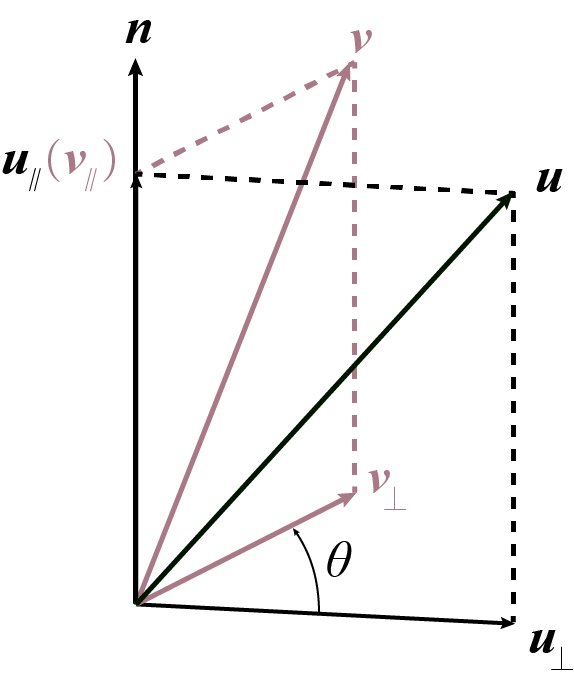

## 依旧是前言

我在前一篇[欧拉角的介绍](https://chzh9311.github.io/ckg9234he000co4ve4pyme6ze/EulerAngle/)里介绍过欧拉角，这是一种很直观的旋转表示。直观并没有什么不对的地方，但是我们人认为的直观，和机器认为的直观是有区别的......


欧拉角，这个旋转的表达方式从欧拉提出开始沿用至今，依然有顽强的生命力。现在的几种流行的 MOCAP 文件格式，ASF / AMC, BVH, C3D，除了最后一种存的是三维坐标，前两种的旋转全部是用欧拉角表示的。说实话，这并不是什么好事儿。都 0202 年了，欧拉角已经两百多年了，居然还在沿用。要说这个表示方法是什么很完美，很经典的方式也就算了，可欧拉角有很多严重的缺陷：比如万向节死锁的问题，会导致一个自由度完全失效。

所以，人们其实研究了一些替代品，比如轴角法表示，以及进一步的四元数表示。四元数表示起来最大的好处就是，连续。这一篇将会简单讲讲四元数的来历，以及推导旋转的四元数表示。

<!--more-->

## 四元数是怎么来的

### 形式主义思维

感性来说，四元数就是这样的一个数：

$$
q = a + bi + cj + dk
$$

其中 $a, b, c, d\in R$, $i, j, k$ 是三个虚数单位。

哈，这篇文章当然不会只有这些，只是这个形式其实是很重要的。

### 复数是怎么来的

先看~~两元数~~复数的由来。

最开始数学家想啊，$x^2=-1$ 这个方程无解，这多不好看啊。要是存在一个数 $i$，它的平方是 $-1$，这不就很有趣了吗，这样一来所有 $n$ 阶方程就都有 $n$ 个根了。有了这个虚数单位，就有了我们最经典的复数形式：

$$
z = a +bi
$$

其中有两个条件：

1. $a, b\in R$

2. 人为规定 $i^2=-1$. 

这一下子就把数域给拓宽了。数学家们又发现$i$有很良好的周期性，于是他们把复数和平面的几何变换结合起来，诶，还挺合适的，复数在平面几何里面发挥了意想不到的作用。

### 两元到四元

平面几何有二元复数可以参与运算，那么立体几何呢？一般复数的两个自由度显然是不够的，因为立体的变换，起码得有三个自由度才够看。我们还回到这个复数的形式上，考虑这个操作：把 $a, b \in R$ 这个条件给删掉。这时的 $a$ 和 $b$，或者表示成 $A$ 和 $B$ 要更合适一些，代表两个复数。就是这样的：

$$
A=a+bi
$$

$$
B=c+di
$$

你可能要奇怪啦：如果把这个 $A$ 和 $B$ 放到上面公式的 $a$ 和 $b$ 里面，结果还是一个二元复数呀，这个操作没有任何意义嘛。这就要改我们的第二个条件了，只不过 $i$ 本身不用改，我们要做的是再加两个虚数单位 $j$ 和 $k$ 进去，而且满足：

1. $i^2=j^2=k^2=-1$
2. $ij=k, jk=i, ki=j$
3. $ij=-ji, jk=-kj, ki=-ik$

先不说这三个条件是干什么的，现在可是急着要把四元数的形式给推导出来。那么，把普通复数的虚数单位 $i$ 换成 $j$，就得到了：

$$
q=A+Bj=(a+bi)+(c+di)j=a+bi+cj+dk
$$

这就是之前看到的那个形式了。

## 四元数和旋三维旋的关系

### 向量的四元数表示

我们知道，三维坐标只有三个自由度，而四元数有四个成员，怎么才能把三维坐标和四元数联系在一起呢？
首先想到的肯定是削减一个自由度，保留另外三个。这里就要用到之前对$ijk$的定义了。相信聪明的你已经发现了，这三个单位的定义有极强的对称性，就像…… 三个坐标轴。而他们的乘法，有着反交换性，这让你想起了什么？

对，叉乘。这几个条件就是让 $i, j, k$ 分别对应到三维坐标系的三个坐标轴方向的单位向量。明确这一点后，接下来说的也就不难理解了：

把上面的字母换一下，换成 $q=w+xi+yj+zk$ ，它就可以写成 $q=(w, \boldsymbol{v})$。其中$w$就是前面的$w$， 通常称为标量部分；$\boldsymbol{v}=[x\quad y\quad z]$，也就是通常说的矢量部分。一个三维向量如果要写成四元数，就把这个三维向量填到四元数的矢量部分，而把标量部分置为 0，也就是 $(0, \boldsymbol{v})$.

按照这种表示方法，一个三维向量就和一个四元数对应起来了。三维旋转，自然而然，就是把一个四元数通过某种方式转化成为另一个四元数。下面重点来啦（咚咚咚敲黑板）

### 单位四元数表示的旋转

**绕单位向量 $\boldsymbol{n}=[n_x\quad n_y\quad n_z]$ 表示的转轴逆时针旋转角度 $\theta$ 的旋转，可以用单位四元数表示成：**

$$
p=(\cos\frac{\theta}{2}, \boldsymbol{n}\sin\frac{\theta}{2})
$$

**写成显式表达为：**

$$
p=\cos\frac{\theta}{2}+in_x\sin\frac{\theta}{2}+jn_y\sin\frac{\theta}{2}+kn_z\sin\frac{\theta}{2}
$$

它的作用方式比较特殊。对于一个给定的向量 $\boldsymbol{v}$，四元数表示是 $q=(0, \boldsymbol{v})$. 显然直接的乘法，即 $pq$ 或者 $qp$ 是得不到想要的旋转结果的。这个作用方式更像是线性代数中讲的二次型，是一种对称的表达形式：

$$
q^\prime=pqp^\star
$$

其中 $p^\star=(\cos\frac{\theta}{2}, -\boldsymbol{n}\sin\frac{\theta}{2})$，是 $p$ 的**共轭**.

区区一个结果怎么能行呢，但真的是要细说，就少不了四元数的运算法则。所以下面我就来细说一下。

## 四元数基本运算

吹水吹完了，要开始硬核了。

为了方便表示，这里规定两个四元数作为我们接下来演示用的小白鼠：

$$
q_1 = (s, \boldsymbol{u}) = a_1+b_1i+c_1j+d_1k
$$

$$
q_2 = (t, \boldsymbol{v}) = a_2+b_2i+c_2j+d_2k
$$

### 加减

加减法很简单，没什么好说的，只要把对应位置的元素加减就行：

$$
q_1\pm q_2=(a_1 \pm a_2)+(b_1 \pm b_2)i+(c_1 \pm c_2)j+(d_1 \pm d_2)k
$$

写成矢量、标量部分分开的表示形式也可以：

$$
q_1 \pm q_2=(s \pm t, \boldsymbol{u} \pm \boldsymbol{v})
$$

### 乘法

之前给出过有关 $i, j, k$ 的运算律：

1. $i^2=j^2=k^2=-1$;
2. $ij=k, jk=i, ki=j$;
3. $ij=-ji, jk=-kj, ki=-ik$.

根据这些，我们把两个四元数当做多项式来计算，就可以得出结果。由于结果太长了，我们换个写法：假定 $q=q_1q_2=[w, x, y, z]$, 那么 

$$
w = a_1a_2-b_1b_2-c_1c_2-d_1d_2
$$

$$
x = a_1b_2+a_2b_1+c_1d_2-c_2d_1
$$

$$
y = a_1c_2+a_2c_1+d_1b_2-d_2b_1
$$

$$
z = a_1d_2+a_2d_1+b_1c_2-b_2c_1
$$

好家伙，这是真的长。有没有更简洁的表达方式呢？答案是有的。把四元数写成矢量、标量部分之后，我们会发现，计算结果的标量部分，也就是上面的 $w$，可以写成：

$$
w=st-\boldsymbol{u}\cdot\boldsymbol{v}
$$

而矢量部分的计算，也就是上面的 $x, y, z$，每一个式子都有四项，这四项可以按照**是否含有标量部分因子**被分为两部分：含有标量因子的组合起来，我们看到它是 $s\boldsymbol{v}+t\boldsymbol{u}$. 而不含有标量因子的部分，看上去像是行列式的形式，这里直接说结论吧，这部分可以写成 $\boldsymbol{u\times v}$. 于是，计算结果可以表示成

$$
q_1q_2=(st-\boldsymbol{u}\cdot\boldsymbol{v}, s\boldsymbol{v}+t\boldsymbol{u}+\boldsymbol{u}\times\boldsymbol{v})
$$

这时，我们请出老朋友二元复数，我们可以看到很多相似点，四元数的乘积比普通的复数多了一项：$\boldsymbol{u}\times\boldsymbol{v}$. 这一项决定了四元数的乘法**没有交换律**，甚至不具有反交换律。有趣的是，如果矢量部分是同向或反向的，这一项就是 0，而对于一般的复数，虚部只有一个单位 $i$，它们只能共线。

### 模

按照直觉，四元数 $q$ 的模 $||q||$，应该就是把四个成员取平方加起来再开方，也就是常说的**二范数**。实际上也是如此。这部分就这样，公式就不写了。是不是很无聊？这可能是本文最无聊的一个小节了 2333。

### 共轭 & 逆

四元数有三个虚部，怎么求共轭呢？答案很简单，就是把三个虚部都反过来。举个例子，$q=(s, \boldsymbol{u})$，那么 $q$ 的共轭为

$$
q^\star=(s, -\boldsymbol{u})
$$

这个定义符合在二元复数里我们对共轭的一般认知，也是就是，满足共轭的运算律。比如说：

$$
qq^\star=q^\star q=||q||^2
$$

$$
q+q^\star=2s, q-q^\star=2\boldsymbol{u}
$$

具体证明按照上面的乘法运算律算一算就知道了，不算复杂。

有了共轭我们也可以定义**逆**，即与原本四元数相乘等于 1 的数。很明显：

$$
q^{-1}=\frac{q^\star}{||q||^2}
$$

## 旋转的四元数表示的来历

### 旋转的分解

为了搞清楚这个问题，我们首先要将旋转操作相关的量用四元数表示出来。其实只有三个相关的向量：旋转前向量 $\boldsymbol{u}$, 旋转后向量 $\boldsymbol{v}$, 和旋转轴 $\boldsymbol{n}$ 和一个角度，即旋转角 $\theta$. 旋转前后的向量可以用纯四元数表示，即转前：$u=(0, \boldsymbol{u})$，转后：$v=(0, \boldsymbol{v})$. 注意，这里的转轴的表示向量 $\boldsymbol{n}$ 是一个单位向量。

要解决这种这种绕固定轴旋转的问题，一个自然的思路是将被旋转的向量分解成平行于轴向的 $\boldsymbol{u}_{\parallel}$ 和垂直于轴向的 $\boldsymbol{u}_\perp$.


显然，旋转对于平行分量是无作用的，只作用于垂直分量。暂且不考虑与转轴平行的分量，我们将目光放在垂直分量上。把 $\boldsymbol{u}_\perp$ 旋转 $\theta$ 角度，得到的结果就是 $\boldsymbol{v}_\perp$，所以后者相对前者的分量，也就是在 $\boldsymbol{u}_\perp$ 和 $\boldsymbol{n}\times\boldsymbol{u}_\perp$ 这两个垂直方向上的分量，我们是知道的，我们有：

$$
\boldsymbol{v}_\perp =\boldsymbol{u}_\perp \cos\theta + \boldsymbol{n}\times\boldsymbol{u}_\perp\sin\theta
$$

对比一下我们之前说过的四元数乘积形式，不难发现，如果我们用 $q=(\cos\theta, \boldsymbol{n}\sin\theta)$ 来左乘 $u_{\perp}=(0, \boldsymbol{u}_\perp)$，会得到：

$$
qu_{\perp}=(0-\boldsymbol{n}\sin\theta\cdot\boldsymbol{u}_\perp, \boldsymbol{u}_\perp\cos\theta+\boldsymbol{n}\times\boldsymbol{u}_\perp\sin\theta)=(0, \boldsymbol{v}_\perp)
$$

### 代数小 trick

我们已经很接近最终结果了，这个结论和最终结论的差异就在于，被乘的是整个 $q$ 而不是它的分量。要做的就是找到一种运算，可以不影响平行分量，只作用于垂直分量。看看在本文开始提出的最终结果，如果把它取平方的话，会发现

$$
p^2=(\cos\theta, \boldsymbol{n}\sin\theta)
$$

这就是我们说的作用于垂直分量的四元数 $q$.

再进一步，我们把旋转写成一个很好看的形式：

$$
v=u_{\parallel}+qu_{\perp}=pp^{-1}u_{\parallel}+ppu_{\perp}
$$

因为 $p$ 是单位四元数，所以 $p^{-1}=p^\star$ （不理解的话可以参考二元复数的性质）注意 $p$ 的**矢量部分，是和转轴平行的**，那么把下面的引理一说，大家就明白我要做什么了：

> **引理：**
> 
> 假设 $u=(0, \boldsymbol{u})$ 是一个纯四元数，而 $q=(\alpha, \beta\boldsymbol{n})$，其中 $\boldsymbol{n}$ 是一个单位向量，$\alpha, \beta \in R$， 那么，根据 $\boldsymbol{n}$ 和 $\boldsymbol{u}$ 之间的关系，有以下结论：
> 
> 1. 若 $\boldsymbol{n} \parallel \boldsymbol{u}$， 则 $qu = uq$;
> 2. 若 $\boldsymbol{n} \perp \boldsymbol{u}$，则 $qu=uq^\star$.

证明同样省略，直接计算就得到了。

有没有发现，旋转后的两项刚好分别符合引理中的两个结论。于是：

$$
\array{v&=&pp^\star u_\parallel+ppu_\perp\;\;\\
&=&pu_\parallel p^\star+pu_\perp p^\star\\
&=&p(u_\parallel+u_\perp)p^\star\;\;\\
&=&pup^\star\qquad\qquad\;}
$$

这就是我们的结论啦。

## 四元数运算的 Python 实现

四元数这个东西说年轻也不算年轻，那么是不是有相关的库呢？我在 GitHub 上面翻了翻，还真有，而且已经有 300+ stars 了。


[> 链接在这 <](https://github.com/moble/quaternion)

具体来说，这个库是为 `numpy` 提供了一个四元数的 `dtype`，而对于简单的单个四元数的运算也是完全可以胜任的。注意，如果你对运行速度有要求（或者单纯有强迫症，不想每次运行都看到 warning），最好安装一下 `numba`，这是一个提高 Python 运行速度的工具。

这个库的安装很简单，因为它已经加入 PyPI 了。注意这个包是基于 `numpy` 的所以要先安装 `numpy`.

```shell
pip install numpy-quaternion
```

有了这个工具，我们就可以轻松地应对四元数的运算了：

```python
import numpy as np
import quaternion

q1 = np.quaternion(1, 2, 3, 4)
q2 = np.quaternion(5, 6, 7, 8)

print("q1 = ", q1)
print("\nq2 = ", q2)
print("\nq1 + q2 = ", q1 + q2) # quaternion(6, 8, 10, 12)
print("\nq2 - q1 = ", q2 - q1) # quaternion(4, 4, 4, 4)
print("\nq2 * q1 = ", q1 * q2) # quaternion(-60, 12, 30, 24)
print("\nThe conjugate of q1 is ", q1.conjugate()) # quaternion(1, -2, -3, -4)
print("\nThe Cayley norm of q1 is ", q1.norm()) # 30.0 这里输出的模的平方，如果要计算模的话，用 q1.abs()

arr = np.array([[q1, q2]])
print("\nThere is an example of array of quaternions:\n", arr)
print("\nIts transpose times itself is:\n", arr.T * arr)
print("\nIts elementwise exponential in base e is:\n", np.exp(arr))
```

注意几个点：

* `numpy` 的一些逐元素执行的运算，如上面例子中的 `numpy.exp` 在这个库中也是实现了的。
  * 这里我没有讲四元数的指数运算，不过其实很简单 w 感兴趣的可以自行了解或者在评论区留言。
* 四元数乘法没有交换律，这一点在矩阵运算的时候也有体现。

## 结尾

> 例行总结好无聊啊，不想写，那就写一下本文的参考吧。

本文的求解思路参考了 [Krasjet](https://github.com/Krasjet) 的[四元数与三维旋转](https://krasjet.github.io/quaternion/)一文。文章讲解十分详实，推荐阅读。

就到这里啦，有什么问题或发现什么错误可以留言或者私信呀。

祝福每一个在努力学习的人 : )
